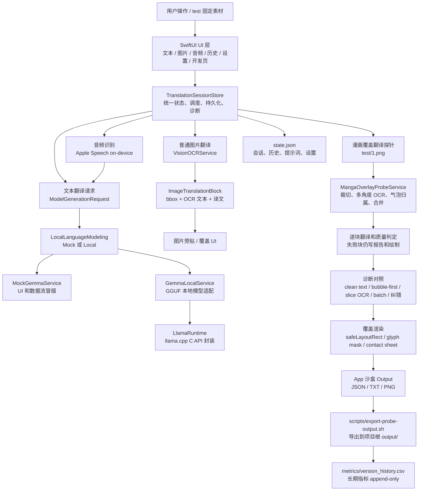
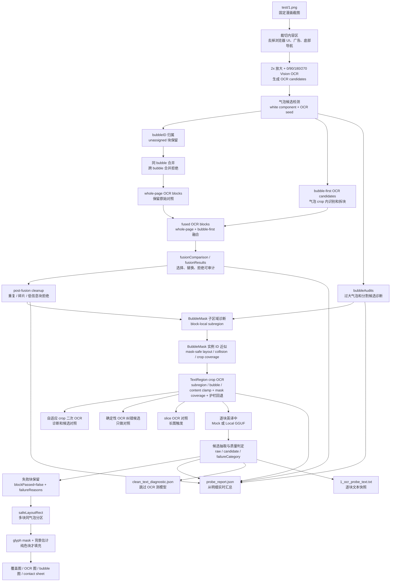
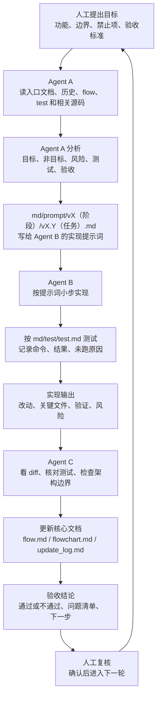

# 项目流程图
本文用 Mermaid 图展示 `md/flow/flow.md` 的当前核心逻辑。读图时先看左到右的主链路，再看向下分叉的诊断和输出产物。

## 1. 项目核心逻辑图
这张图描述 App 从用户入口到状态调度、OCR/模型服务、持久化和探针输出的关系。

## 2. 漫画探针执行流
这张图只看 `test/1.png` 的 OCR、翻译和覆盖合成链路。实线是主流程，旁路节点是诊断对照，不能在未验证前替代主流程。

## 3. Agent 迭代流程图
这张图描述以后每轮任务如何从人工目标进入 Agent A、Agent B、Agent C，再回到人工复核。

