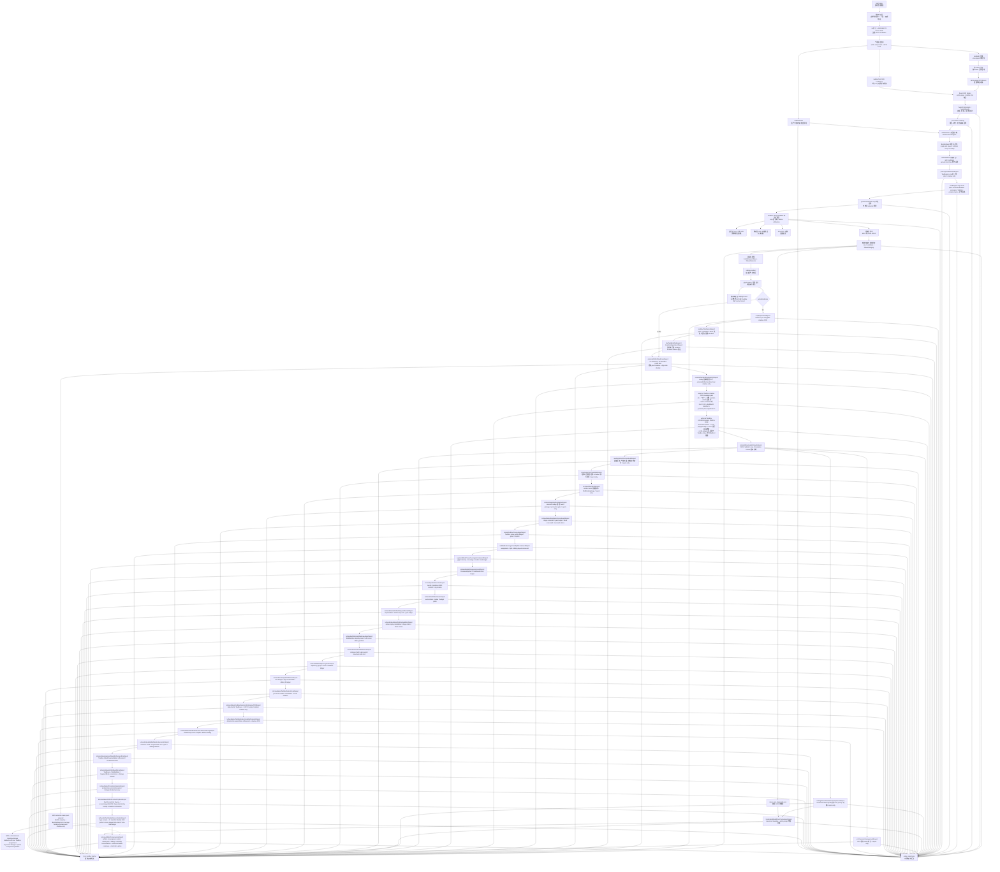
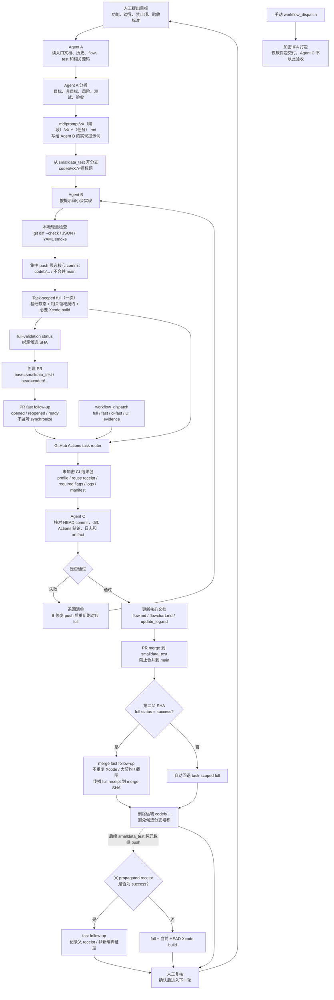

# 项目流程图
v3.376 translation metadata content boundary（进行中）：`leading content-sensitive marker + natural payload -> preserve translated content; standalone/punctuation-delimited marker -> remove prompt metadata -> existing validation/QA`；产品只把 `translation engine`、`输出风格` 的独立或标点分隔行首形态当作 prompt metadata，明确指令 marker、表格、标签、OCR/layout、预算、逐块回退、取消、持久化和非日语路径不变。新增合同 `scripts/test-v3376-translation-metadata-content-boundary-contract.py`，工程版本 `3.376`，CI 已接入；exact-SHA full/merge receipt 待执行；`test/3.png` 未提供，不伪造质量证据，Koharu/GGUF、授权语料和目标设备证据不阻塞普通路径。

v3.375 translation refusal-marker boundary（已完成）：`embedded refusal phrase -> preserve translated content; leading refusal/apology + marker -> fail closed -> existing shared QA`；产品与 cloud shadow evaluator 只在响应开头或有限道歉前缀后识别拒答，正文中的“无法翻译/翻译失败”等短语不再被误判；OCR/layout、预算、标签、逐块回退、取消、持久化和非日语路径不变。新增合同 `scripts/test-v3375-translation-refusal-marker-boundary-contract.py`，工程版本 `3.375`，CI 已接入；本地安全合同 `374/374` 通过、27 个进程/编译/runtime 入口跳过（`401` 总计），Python AST `401/401`、JSON `144/144`、YAML `3/3`、shell `32/32`、plist `4/4` 与 `git diff --check` 通过；exact-SHA full [33357611551](https://github.com/bengzhu/project1_lgbt_naxida/actions/runs/33357611551)、PR [#439](https://github.com/bengzhu/project1_lgbt_naxida/pull/439) checks [33358377260](https://github.com/bengzhu/project1_lgbt_naxida/actions/runs/33358377260)、merge SHA `fb32332d19860224fb13310c07f75db316391053` 与合入后 push CI [33358439503](https://github.com/bengzhu/project1_lgbt_naxida/actions/runs/33358439503) 均成功，发布 `AITRANS CI/full-validation=success` receipt；`test/3.png` 未提供，不伪造质量证据，Koharu/GGUF、授权语料和目标设备证据不阻塞普通路径。

v3.374 translation batch preamble recovery（已完成）：`known standalone preamble -> strip only before first [N] -> existing strict tag parser/order/QA`；产品只移除已知整行前导元信息，未知前导文本、标签顺序/完整性仍 fail-closed，OCR/layout、预算、逐块回退、取消、持久化和非日语路径不变。新增合同 `scripts/test-v3374-translation-batch-preamble-contract.py`，工程版本 `3.374`，CI 已接入；本地安全合同 `373/373` 通过、27 个进程/编译/runtime 入口跳过（`400` 总计），Python AST `400/400`、JSON `144/144`、YAML `3/3`、shell `32/32`、plist `4/4` 与 diff 检查通过。实现 SHA `16425ddbaab9597958fbe350fd0e361a0553c948` 的 exact full [33355934806](https://github.com/bengzhu/project1_lgbt_naxida/actions/runs/33355934806)、PR [#438](https://github.com/bengzhu/project1_lgbt_naxida/pull/438) checks、merge SHA `5e54836e22fca7574ba8685cf77f86f743a09394` 与合入后 push [33356807008](https://github.com/bengzhu/project1_lgbt_naxida/actions/runs/33356807008) 均成功；`test/3.png` 未提供，不伪造质量证据，Koharu/GGUF、授权语料和目标设备证据不阻塞普通路径。

v3.373 translation term width QA（已完成）：`confirmed term -> canonical Unicode/case/width folding -> punctuation-preserving containment -> shared translation QA`；产品与 cloud shadow evaluator 同步，OCR/layout、预算、标签、逐块回退、取消、持久化和非日语路径不变。新增合同 `scripts/test-v3373-translation-term-width-qa-contract.py`，工程版本 `3.373`，CI 已接入；本地安全回归 `372/372`、Python AST `399/399`、tracked JSON `144/144`、YAML `3/3`、shell `32/32`、plist `4/4` 与 diff 检查通过。exact full [33353855302](https://github.com/bengzhu/project1_lgbt_naxida/actions/runs/33353855302)、PR [#437](https://github.com/bengzhu/project1_lgbt_naxida/pull/437) checks [33354891526](https://github.com/bengzhu/project1_lgbt_naxida/actions/runs/33354891526)、merge SHA `b69d2995137ac52d7ade3b003114fc080cadaf5e` 与合入后 push [33354973808](https://github.com/bengzhu/project1_lgbt_naxida/actions/runs/33354973808) 均成功；`test/3.png` 未提供，不伪造质量证据，Koharu/GGUF、授权语料和目标设备证据不阻塞普通路径。

v3.372 Vision vertical line single-rotation（已完成）：`vertical quad -> bounded unrotated projection -> crop preparation -> one requested rotation -> Vision line OCR -> existing fusion/translation QA`；direct sampler 不再在 projection helper 内提前 `rotate270`，Core Image fallback 与 direct path 共用未旋转边界，detector-owned Manga OCR quad 仍保留自身单次 `rotate270`。8 次 line OCR、2 个 geometry-only 名额、16M budget、owner/quality/layout、取消、持久化和非日语路径不变。新增合同 `scripts/test-v3372-image-japanese-line-single-rotation-contract.py`，工程版本 `3.372`，CI 已接入；本地安全回归 `371/371` 通过、27 个进程/编译/runtime 入口跳过（`398` 总计），Python AST `398/398`、JSON `144/144`、YAML `3/3`、shell `32/32`、plist `4/4` 与 diff 检查通过；exact full [33351843254](https://github.com/bengzhu/project1_lgbt_naxida/actions/runs/33351843254)、PR checks [33352464164](https://github.com/bengzhu/project1_lgbt_naxida/actions/runs/33352464164)、merge SHA 4e02d6337f8516c8df1cd20a62ac7cdca049704c、合入后 push [33352543308](https://github.com/bengzhu/project1_lgbt_naxida/actions/runs/33352543308) 与 AITRANS CI/full-validation=success 均通过；`test/3.png` 未提供，不伪造质量证据，Koharu/GGUF、授权语料和目标设备证据不阻塞普通路径。

v3.371 Translation leading-prompt recovery（已完成）：`leading prompt echo -> remove metadata line -> keep following translation -> existing validation/QA`；`Output only:` 同行 payload 可保留，真实译文后的 prompt 行仍截断，硬 turn token、嵌入正文短语、OCR/layout、预算、标签、取消、持久化和非日语路径不变。新增合同 `scripts/test-v3371-translation-leading-prompt-recovery-contract.py`，工程版本 `3.371`，CI 已接入；本地安全合同 `370/370` 通过、27 个进程/编译/runtime 入口跳过；exact full [33346717836](https://github.com/bengzhu/project1_lgbt_naxida/actions/runs/33346717836)、PR checks [33346679209](https://github.com/bengzhu/project1_lgbt_naxida/actions/runs/33346679209)、merge SHA `f1f606d36abc8fb12845c08626ff8e9da49c4d1b`、合入后 push [33347337847](https://github.com/bengzhu/project1_lgbt_naxida/actions/runs/33347337847) 与 `AITRANS CI/full-validation=success` 均通过；候选 Xcode/JUnit `10/10`/manifest 成功，`test/3.png` 未提供，不伪造质量证据，Koharu/GGUF、授权语料和目标设备证据不阻塞普通路径。

v3.370 Translation control-marker boundary（已完成）：`raw model output -> preserve embedded control-like prose -> cut only terminal tokens or line-start prompt echo -> existing translation QA`；合法译文中间出现 `Translate the following text`/`Output only` 不再被任意位置截断，独立行首提示回显仍移除，OCR/layout、预算、标签、QA、取消、持久化和非日语路径不变。新增合同 `scripts/test-v3370-translation-control-marker-boundary-contract.py`，工程版本 `3.370`，CI 已接入；本地安全合同 `369/369` 通过、27 个进程/编译/runtime 入口跳过；exact full [33321228109](https://github.com/bengzhu/project1_lgbt_naxida/actions/runs/33321228109)、PR [#434](https://github.com/bengzhu/project1_lgbt_naxida/pull/434) checks [33321140688](https://github.com/bengzhu/project1_lgbt_naxida/actions/runs/33321140688)、merge SHA `728cbcb8684475e08da61d3d3670862a2170958f`、合入后 push [33322001689](https://github.com/bengzhu/project1_lgbt_naxida/actions/runs/33322001689) 与 `AITRANS CI/full-validation=success` 均通过；`test/3.png` 未提供，不伪造质量证据，Koharu/GGUF、授权语料和目标设备证据不阻塞普通路径。

v3.369 Translation placeholder precision（已完成）：`raw translation -> line-start request + explicit translation-input gate -> preserve natural short dialogue -> existing shared QA`；只有行首请求且明确指向待翻译输入时才判 placeholder，`请提供文本`/`请输入内容` 等合法译文保留，既有拒绝、标签、数字/术语/目标语言 QA、OCR/layout、预算、取消、持久化与非日语路径不变。新增合同 `scripts/test-v3369-translation-placeholder-precision-contract.py`，工程版本 `3.369`，CI 已接入；本地安全合同 `368/368` 通过、27 个进程/编译/runtime 入口跳过；exact full [33319870129](https://github.com/bengzhu/project1_lgbt_naxida/actions/runs/33319870129)、PR [#433](https://github.com/bengzhu/project1_lgbt_naxida/pull/433) checks [33319863115](https://github.com/bengzhu/project1_lgbt_naxida/actions/runs/33319863115)、merge SHA `1f7654c95ca87955ec65f4b0a26e409b6056e454`、合入后 push [33320584895](https://github.com/bengzhu/project1_lgbt_naxida/actions/runs/33320584895) 与 `AITRANS CI/full-validation=success` 均通过；`test/3.png` 未提供，不伪造质量证据，Koharu/GGUF、授权语料和目标设备证据不阻塞普通路径。

v3.368 Translation metadata prefix boundary（已完成）：`raw translation -> line-start-only prompt metadata filter -> preserve embedded phrase -> existing validation/QA`；只有行首 prompt marker 才被移除，合法译文中间出现 `translation engine`/`输出风格` 不再整行丢弃；表格、明确 metadata bullet、翻译标签、placeholder/source leakage/数字/目标语言 QA 继续有效。OCR/layout、预算、取消、持久化和非日语路径不变。新增合同 `scripts/test-v3368-translation-metadata-prefix-contract.py`，工程版本 `3.368`，CI 已接入；本地安全合同 `367/367` 通过，27 个进程/编译/runtime 入口跳过；exact full [33318086676](https://github.com/bengzhu/project1_lgbt_naxida/actions/runs/33318086676)、PR checks [33318078495](https://github.com/bengzhu/project1_lgbt_naxida/actions/runs/33318078495)、merge SHA `9d3a3d604a4500191073e558f69fd3bd0f161bc6`、合入后 push [33318776814](https://github.com/bengzhu/project1_lgbt_naxida/actions/runs/33318776814) 与 `AITRANS CI/full-validation=success` 均通过；`test/3.png` 未提供，不伪造质量证据，Koharu/GGUF、授权语料和目标设备证据不阻塞普通路径。

v3.367 Translation numeric token Unicode QA（已完成）：`block translation -> shared QA -> canonicalize fullwidth numeric digits/separators -> exact numberMismatch`；`１２３` 与 `123` 视为同一数字 token，前导零、token 顺序、分隔符以及缺失/合并/拆分数字仍保持严格失败。OCR/layout、预算、取消、持久化和非日语路径不变。新增合同 `scripts/test-v3367-translation-numeric-token-unicode-contract.py`，工程版本 `3.367`，CI 已接入；本地安全合同 `366/366` 通过，27 个进程/编译/runtime 入口跳过，exact full [33316619753](https://github.com/bengzhu/project1_lgbt_naxida/actions/runs/33316619753)、merge SHA `47d49cee95590e45d4e50255c1298d82199f5fb3`、合入后 push [33317161956](https://github.com/bengzhu/project1_lgbt_naxida/actions/runs/33317161956) 与 `AITRANS CI/full-validation=success` 均通过；`test/3.png` 未提供，不伪造质量证据。

v3.366 Japanese fallback context scope（已完成）：`mixed [N] batch -> exact per-block kind -> strip mixed style metadata -> expose kind-specific output limit -> existing block QA`；批量失败/质量补译的 plain-text 单块请求只接收当前块的文字类型，confirmed 术语与已完成上一批只读摘要仍保留；无 `textKind` 的块按 batch offset 或 dialogue fallback，不继承首块类型。OCR/layout、标签、8 块/1,800 字符预算、取消、持久化和非日语路径不变。新增合同 `scripts/test-v3366-japanese-fallback-context-scope-contract.py`，工程版本 `3.366`，CI 已接入；本地安全合同 `365/365` 通过，27 个进程/编译/runtime 入口跳过，Python AST `412/412`、JSON `144/144`、YAML `3/3`、shell `32/32`、plist `4/4` 与 diff 检查通过。实现 SHA `39cadeb70c0e0d4c800e9b86957913ecf32fb0cb`、exact full [33315051697](https://github.com/bengzhu/project1_lgbt_naxida/actions/runs/33315051697)、PR [#430](https://github.com/bengzhu/project1_lgbt_naxida/pull/430) checks [33315618865](https://github.com/bengzhu/project1_lgbt_naxida/actions/runs/33315618865)、merge SHA `a6286f876e80fd6d6d33f062d26078817b708fe4`、合入后 push [33315668737](https://github.com/bengzhu/project1_lgbt_naxida/actions/runs/33315668737) 与 `AITRANS CI/full-validation=success` 均通过；Koharu/GGUF、授权语料和目标设备不阻塞，`test/3.png` 未提供，不伪造质量证据。

v3.365 Japanese kind-style scope（已完成）：`mixed [N] batch -> exact global ordinals -> per-kind scoped style guidance -> existing block QA`；对白、旁白、拟声词、标题和其它文字类型各自只作用于对应编号块，单块请求保留局部类型提示。OCR/layout、标签、8 块/1,800 字符预算、取消、持久化和非日语路径不变。新增合同 `scripts/test-v3365-japanese-kind-style-scope-contract.py`；本地安全合同 `364/364` 通过，27 个进程/编译/runtime 入口跳过；实现 SHA `1a37c127`、exact full [33313408977](https://github.com/bengzhu/project1_lgbt_naxida/actions/runs/33313408977)、PR checks [33313973492](https://github.com/bengzhu/project1_lgbt_naxida/actions/runs/33313973492)、merge SHA `782cc7be`、合入后 push [33314013235](https://github.com/bengzhu/project1_lgbt_naxida/actions/runs/33314013235) 与 `AITRANS CI/full-validation=success` 均通过；云端 Xcode/JUnit/manifest 通过，Koharu 按配置跳过，`test/3.png` 未提供，不伪造质量证据。

v3.364 Japanese SFX scope（已完成）：`mixed [N] batch -> exact global SFX ordinals -> scoped sound-effect hint -> existing block QA`；声效规则只作用于对应编号块，dialogue/narration/title 块不继承 SFX 约束；单块 standard SFX 保留局部提示。OCR/layout、标签、8 块/1,800 字符预算、取消、持久化和非日语路径不变。新增合同 `scripts/test-v3364-japanese-sfx-scope-contract.py`；本地安全合同 `363` 个通过、`27` 个进程/编译/runtime 入口跳过（`390` 总计），exact full [33311997816](https://github.com/bengzhu/project1_lgbt_naxida/actions/runs/33311997816)、PR checks [33312526828](https://github.com/bengzhu/project1_lgbt_naxida/actions/runs/33312526828)、merge SHA `bba2cb84`、合入后 push [33312575192](https://github.com/bengzhu/project1_lgbt_naxida/actions/runs/33312575192) 与 `AITRANS CI/full-validation=success` 均通过；`test/2.png` 仅作已有混合漫画参考，`test/3.png` 未提供，不伪造质量证据。

v3.363 Japanese standard translation prompt（已完成）：`Japanese plain-text fallback/reread -> explicit language pair -> faithful plain output -> existing block-only QA`；日语→简体中文/英语的 standard 请求明确源/目标语言和只输出译文，保留称谓、专名、语气与拟声词；`[N]` manga batch、OCR/layout、预算、取消、持久化和非日语路径不变。新增合同 `scripts/test-v3363-japanese-standard-translation-prompt-contract.py`；实现 SHA `ae20f960`、exact full [33310548726](https://github.com/bengzhu/project1_lgbt_naxida/actions/runs/33310548726)、PR checks [33311049315](https://github.com/bengzhu/project1_lgbt_naxida/actions/runs/33311049315)、merge SHA `e437c67c`、合入后 push [33311104151](https://github.com/bengzhu/project1_lgbt_naxida/actions/runs/33311104151) 均成功，Xcode/JUnit/manifest 与 `AITRANS CI/full-validation=success` receipt 通过；`test/3.png` 未提供，不伪造质量证据。

v3.362 Japanese translation context-echo boundary（已完成）：`previous batch summary -> exact normalized echo + different source -> existing block-only QA retry`；合法嵌入短语与重复同一原文不再被宽泛 context-leak gate 误拒绝，既有 OCR、layout、预算、标签、取消、持久化和非日语路径不变。新增合同 `scripts/test-v3362-japanese-translation-context-echo-contract.py`；实现 SHA `90fcf107`、exact full [33308856823](https://github.com/bengzhu/project1_lgbt_naxida/actions/runs/33308856823)、PR [#426](https://github.com/bengzhu/project1_lgbt_naxida/pull/426) checks [33309325698](https://github.com/bengzhu/project1_lgbt_naxida/actions/runs/33309325698)、merge SHA `b699952b`、合入后 push [33309456645](https://github.com/bengzhu/project1_lgbt_naxida/actions/runs/33309456645) 均成功，`AITRANS CI/full-validation=success`；`test/3.png` 不伪造。

v3.361 Japanese pixel compact dedupe（已完成）：`rotated Vision pixel regions -> geometry dedupe -> comparable compact preference -> reserved <=4 compact recovery -> bounded 12 pixel crops`；同一且面积可比的重复 envelope 保留 compact 资格，明显更宽的 regular region 不被替换，既有预算、OCR/layout、翻译 QA、取消、持久化和非日语路径不变。新增合同 `scripts/test-v3361-japanese-pixel-compact-dedupe-contract.py` 已接入，合同 `8/8`；exact full [33306958641](https://github.com/bengzhu/project1_lgbt_naxida/actions/runs/33306958641)、PR checks [33307449223](https://github.com/bengzhu/project1_lgbt_naxida/actions/runs/33307449223)、merge push [33307511951](https://github.com/bengzhu/project1_lgbt_naxida/actions/runs/33307511951) 与 `AITRANS CI/full-validation=success` 均通过，`test/3.png` 不伪造。
v3.360 Japanese recovery-frontier block skip（已完成）：`line/pixel/tile recovery -> read-only unique TextRegion owner annotation -> strict one-to-one source-line coverage -> duplicate block crop skip or existing fallback`；弱、部分、ownerless、歧义或 foreign-owner 结果不能证明 known block 完整覆盖，既有预算、owner/layout、翻译 QA、取消、持久化和非日语路径不变。新合同 `scripts/test-v3360-japanese-recovery-frontier-block-skip-contract.py` 已接入，合同 `9/9`；exact-SHA full [33305439236](https://github.com/bengzhu/project1_lgbt_naxida/actions/runs/33305439236)、PR checks [33305910849](https://github.com/bengzhu/project1_lgbt_naxida/actions/runs/33305910849)、merge push [33305962983](https://github.com/bengzhu/project1_lgbt_naxida/actions/runs/33305962983) 与 `AITRANS CI/full-validation=success` 均通过，`test/3.png` 不伪造。

v3.359 Japanese shared-Han QA exactness（已完成）：`image block translation -> normalized source-leakage gate -> exact shared-Han exception -> existing block-only retry`；`日本→日本` 仍可按既有窄 policy 放行，`日本→日本人` 与单字共享汉字不放行；OCR、layout、请求预算、标签、取消、持久化和非日语路径保持不变，exact full [33303966969](https://github.com/bengzhu/project1_lgbt_naxida/actions/runs/33303966969)、PR checks [33304583260](https://github.com/bengzhu/project1_lgbt_naxida/actions/runs/33304583260)、merge push [33304633237](https://github.com/bengzhu/project1_lgbt_naxida/actions/runs/33304633237) 均通过。

v3.358 Japanese shared-Han model cleanup（已完成）：`Japanese->Simplified Chinese model output -> narrow unchanged Han policy -> existing standard/tagged cleaner -> product QA`；只放行规范化后相同的纯汉字共享词，OCR/geometry/layout、预算、tag/QA、取消、持久化与非日语路径不变；exact full [33302341558](https://github.com/bengzhu/project1_lgbt_naxida/actions/runs/33302341558)、merge push [33302865592](https://github.com/bengzhu/project1_lgbt_naxida/actions/runs/33302865592)、Xcode build、JUnit `10/10` 与 `AITRANS CI/full-validation=success` 均通过。
v3.357 Japanese kana SFX translation recall（已完成）：`Japanese OCR block -> conservative kana-shape classifier -> existing text-kind metadata -> tagged translation prompt -> short SFX/action wording`；只扩展高信号假名声效形状，OCR 请求、候选预算、geometry/layout、tag/QA、取消、持久化和非日语路径保持不变。exact full [33300948175](https://github.com/bengzhu/project1_lgbt_naxida/actions/runs/33300948175)、merge push [33301557301](https://github.com/bengzhu/project1_lgbt_naxida/actions/runs/33301557301)。

v3.356 Japanese compact spatial balance（已完成）：`compact candidates -> existing y/x priority -> owner-independent multi-band selector -> reserved <=4 compact recovery -> bounded 12 pixel crops`；跨 band 的短候选获得有限复读机会，under-budget/single-band、OCR/layout、翻译 QA、取消和持久化边界不变。实现 SHA `a3b53349`、merge SHA `aa8fc40b`、exact full [33299312826](https://github.com/bengzhu/project1_lgbt_naxida/actions/runs/33299312826)、合入后 push CI [33299935514](https://github.com/bengzhu/project1_lgbt_naxida/actions/runs/33299935514)。
v3.355 Japanese geometry-owner balance（已完成）：`geometry-only candidates -> existing coverage/owner gate -> owner-balanced <=2 geometry reserve -> bounded 8-request Manga line OCR`；同一 known owner 不再独占两个 geometry 名额，under-budget/single-owner/ownerless、OCR/layout、翻译 QA、取消和持久化边界不变。实现 SHA `0568d4d1`、merge SHA `be23a758`、exact full [33298161646](https://github.com/bengzhu/project1_lgbt_naxida/actions/runs/33298161646)、合入后 push CI [33298644345](https://github.com/bengzhu/project1_lgbt_naxida/actions/runs/33298644345)。
v3.354 Japanese direction-confidence owner domain（已完成）：`vertical candidate/line owner geometry -> finite [0,1] domain -> >=.25 owner gate -> known-owner or ownerless compatibility`；非法方向分数不取得跨块 owner，合法门、既有预算、line/pixel/tile/frontier、OCR/layout、翻译 QA、取消和持久化边界不变。实现 SHA `86500c81`、merge SHA `885dc9ea`、exact full [33297024649](https://github.com/bengzhu/project1_lgbt_naxida/actions/runs/33297024649)、合入后 push CI [33297547961](https://github.com/bengzhu/project1_lgbt_naxida/actions/runs/33297547961)。
v3.353 Japanese vertical crop risk balance（已完成）：`vertical blocks -> risk-class-first queue -> same-class band round-robin -> bounded 16 crops`；dense weak band 不再被 strong other bands 先挤出，剩余名额仍按空间均衡补齐，单 band/未超预算/无风险行为、8 次方向 fallback、line/pixel/tile/frontier、owner、OCR/layout、翻译 QA、取消和持久化边界不变。
v3.352 Japanese direction-confidence risk domain（已完成）：`vertical recovery -> finite closed [0,1] direction confidence -> risk gate/order -> bounded crop/recovery`；`NaN/±∞` 与有限越界方向值按弱候选处理，合法 `[0,1]` 与 `.45` 门、16/8/4 上限、pixel/line/tile/frontier、owner、OCR/layout、翻译 QA、取消和持久化边界不变。
v3.351 Japanese pixel recovery block eligibility（已完成）：`layout blocks -> finite normalized direction/OCR/Japanese quality gate -> pixel-first geometry coverage -> bounded 12-crop recovery`；弱/空/非日语/低密度/方向不确定 block 不遮蔽 pixel-first，可靠 block 与 observation/line frontier 仍抑制重复 geometry，最多 12 个 crop、方向 4、tile/block recovery、OCR/layout、翻译 QA、取消和持久化边界不变。
v3.350 Japanese tile direction eligibility（已完成）：`vertical blocks -> finite normalized direction confidence >=.45 + nonempty Japanese/OCR quality gate -> existing vertical tile coverage`；方向不确定、弱/空/非日语 block 不遮蔽 bounded 18-window tile fallback，可靠 block 与 line frontier 仍抑制重复 geometry，最多 6 个 tile、方向 4、pixel-first/line/block recovery、翻译 QA、取消和持久化边界不变。
v3.349 Japanese tile coverage eligibility（已完成）：`vertical blocks -> nonempty Japanese + finite confidence >=.48 + letter/script density >=.5 -> existing vertical tile coverage`；弱/空/非日语 block 不再遮蔽 bounded 18-window tile fallback，可靠 block 与 line frontier 仍抑制重复 geometry，最多 6 个 tile、方向 4、pixel-first/line/block recovery、翻译 QA、取消和持久化边界不变。
v3.348 Japanese pixel recovery eligibility（已完成）：`vertical provenance/role -> nonempty Japanese + finite confidence >=.48 + letter/script density >=.5 -> existing vertical coverage`；弱/空/非日语读数不再遮蔽 bounded 12-crop pixel-first recovery，可靠读数仍抑制重复 geometry，compact owner 例外、方向 4、line/tile frontier、翻译 QA、取消和持久化边界不变。
v3.347 Japanese recovery frontier：`lineRefined + reliable pixel-first output -> shared tile coverage frontier -> bounded 18-window tile fallback`；pixel-first 只有通过既有 verticalLine/finite confidence/Japanese density/vertical geometry gate 才能抑制重复 tile，弱/空结果不改变 fallback，预算、方向、翻译 QA、取消和持久化边界不变。
v3.346 Japanese pixel-first regular crop spatial balance：`pixel-first regions -> compact reserve(<=4) -> regular multi-band round-robin -> bounded 12 crops -> existing Vision orientation/fusion`；仅多 band 超出 regular 剩余名额时均衡，保留 compact/12/4 上限、geometry、质量门、翻译 QA、取消与持久化边界。
v3.345 Japanese vertical crop spatial balance：`risk-first vertical layout blocks -> multi-band over-budget round-robin -> bounded 16-block crop queue -> existing owner/line/fallback fusion`；仅多 band 超过既有 16 个名额时均衡 block crop，最终恢复原风险顺序，line/pixel/tile、8 次 orientation fallback、质量门、owner/layout、翻译 QA、取消与持久化边界不变。
v3.344 Japanese weak-block recovery spatial balance：`weak layout blocks -> finite-confidence priority -> multi-band over-budget round-robin -> bounded four-block scoped reread -> measurable replacement`；只有弱候选超过 4 且分布到多个纵向 band 时均衡既有名额，候选不足/单 band 恢复原前缀，保留质量门、失败/取消、布局、翻译 QA 与持久化边界。
v3.343 Japanese Vision line owner balance：`Vision line candidates -> over-budget owner-balanced perspective/axis queues -> bounded 24-item rereads -> Manga/Vision fusion`；只在既有 24 项 Vision 队列会漏掉 known vertical TextRegion owner 时替换已覆盖 owner 的重复候选，保留 quad/bbox crop、12 次 orientation fallback、16M perspective 像素预算、Manga 8/2 请求边界、ownerless 历史兼容与下游布局/翻译/取消/持久化边界。
v3.340 Japanese line coverage source boundary：`page/line observations -> exclude detector TextRegion bbox -> existing owner/quality/geometry one-to-one proof -> block crop fallback`；块级 detector 区域不能单独证明多行已完整识别，既有 OCR 预算、crop/warp、owner/layout、翻译 QA、取消和持久化不变。
v3.339 detector 同标签跨切片合并闭包：`slice predictions -> same-label existing geometry gates -> merge/replacement -> restart complete slice scan -> TextRegion merge closure -> Manga OCR`；跨切片相邻重复区域不再依赖 detector 输出顺序，阈值、confidence 域、12/48 预算、crop/warp、owner/layout、翻译 QA、取消和持久化不变。
v3.338 detector TextRegion 合并闭包：`detector predictions -> existing IoU/containment -> union envelope -> restart prior-candidate scan -> merged TextRegion -> confidence sort/Manga OCR`；保持现有阈值、confidence 域、detector primary、12/48 预算、crop/warp、owner/layout、翻译 QA、取消和持久化边界，重叠链不再依赖遍历顺序。
v3.337 Japanese line candidate 调度闭包：`text-backed vertical line candidates -> weak/text/density risk gate -> risk-first bounded line queue -> non-risk length order -> reserved geometry-only slots -> Manga/Vision fusion`；短、低置信、低日文字信号或低脚本密度 line 先占用既有 text-backed 名额，同风险组按有限 confidence、日文字母数和脚本文字密度弱者优先，非风险组继续长文本优先，最多 8 个 line OCR 请求、2 个 geometry-only 保留位、detector-owned 排除、line-first、owner/coverage、翻译 QA、取消和持久化不变。
v3.336 Japanese vertical block crop 调度闭包：`vertical layout blocks -> weak/text/direction risk gate -> risk-first bounded 16-block crop queue -> existing owner/line/fallback fusion`；风险 block 先占用既有 crop 名额，同风险组按有限 confidence 弱者优先，最多 16 个 block、8 个 orientation fallback、owner/geometry、翻译 QA、取消与持久化边界不变。v3.335 Japanese line-candidate confidence 闭包：`text-backed vertical line candidate -> finite [0,1] gate -> bounded weak-first line OCR queue`；非法值不会占用最多 8 次 line OCR 预算，合法同长度候选仍按较弱 confidence 优先复读，geometry-only 保留位不变。v3.334 layout confidence 全序闭包：`raw layout confidence -> finite + [0,1] normalization -> finite ordering key -> observation/block/vertical tie-break`；非法值不会进入 raw `Float` comparator，合法值、几何/文字顺序、OCR 请求预算、owner/layout、翻译 QA、取消和持久化不变。
v3.333 detector confidence 预算闭包：`raw logit -> finite -> sigmoid -> [0,1] validator -> top-query -> merged TextRegion revalidation -> long-page request ranking`；非法值在占用 detector/Manga OCR 预算前 fail closed，合法 confidence、几何 tie-break、12/48 请求上限、primary precedence、翻译 QA、取消和持久化不变。

v3.332 OCR confidence 合法域：`raw confidence -> finite + [0,1] validator -> candidate/gate/score -> layout/review`；有限越界值与 NaN/±∞ 同样 fail closed，合法 `.14/.40/.48/.55` 语义、12/8/4 orientation、4 weak-block 上限、owner/layout、翻译 QA、取消和持久化不变。

v3.331 日语 OCR confidence 全序：`top-5 alternatives -> finite filter -> existing .14 window -> finite-first observation comparison -> orientation/weak-block recovery -> fusion/layout`；NaN/∞ fail closed，有限候选分数、标点 fallback、12/8/4 orientation 与 4 weak-block 上限、翻译 QA、取消和持久化不变。
v3.330 OCR observation best reducer：`observation pool -> candidate-first descending reducer -> strongest observation -> scoped Vision selection / orientation fallback / synthesized provenance / diagnostics`；强结果不再被误选的弱项触发多余 opposite request 或单块弱选，竖列合成的 rotation/role 来自最强 fragment，文字、平均 confidence、rect/owner、请求上限、翻译 QA、取消与持久化不变。
v3.329 普通日语 duplicate fusion 门：`geometry duplicate -> exclude detector/compact dedicated policy -> meaningful Japanese candidate + confidence >=.40 + within incumbent -.14 -> replace noisy ordinary Vision incumbent -> preserve owner/boundary`；无合格重复项时保留标点，远低置信日文不替换，非日语、请求预算、翻译 QA、取消与持久化不变。
v3.328 普通日语 recovery Vision 候选池门：`top-5 alternatives -> meaningful Japanese text filter -> bounded candidate score -> existing observation/fallback/coverage policy`；不统一 compact/line/Manga confidence，整页标点 fallback、请求预算、crop/owner/layout、翻译和持久化边界不扩大。
v3.327 日语单块 Vision 候选池门：`top-5 alternatives -> full usable filter -> bounded candidate score -> cross-angle usable filter -> observation score -> Manga/Vision scoped selector`；弱高分噪声不再遮蔽同池或其它方向的合格日文，整页标点 fallback、请求预算、取消、翻译和持久化边界不扩大。
v3.326 日语单块 two-sided 返回门：`Manga + Vision scoped candidates -> full usable gate per engine -> one usable candidate / bounded comparator / nil`；弱双候选不再绕过完整质量门，整页标点 fallback、请求预算、取消、翻译和持久化边界不扩大。
v3.325 日语单块 one-sided 返回门：`bounded Manga/Vision scoped reread -> sole candidate -> finite confidence + actual-letter + letter/script-density gate -> replace existing block OR preserve failure state`；双候选比较、整页标点 fallback、请求预算、取消、翻译和持久化边界不扩大。
v3.324 日语 Vision line 返回门：`perspective/axis line crop -> meaningful Japanese observation filter -> line fusion/coverage OR bounded axis opposite/block fallback`；低密度标点噪声不提交，24 perspective/24 axis、12 orientation fallback、crop/warp、owner、layout/翻译、取消和持久化边界不扩大。
v3.323 日语 block fallback 返回门：`incomplete line coverage -> bounded block crop -> meaningful Japanese observation filter -> owner coverage/partial-line replacement/fusion OR keep existing lines`；低密度标点噪声不提交，16 block、8 orientation fallback、crop/owner、layout/翻译、取消和持久化边界不扩大。
v3.322 日语 Vision recovery 返回门：`pixel-first/tile crop -> meaningful Japanese observation filter -> geometry/fusion OR bounded opposite/block fallback`；低密度标点噪声不提交，请求、crop/owner、layout/翻译、取消和持久化边界不扩大。
v3.321 日语 line OCR 返回门：`bounded Manga line result -> meaningful Japanese density -> owner match -> verticalLine commit OR existing Vision/block fallback`；高置信标点噪声不再进入 line fusion/layout，不增加请求或改变 geometry/翻译/持久化边界。
v3.320 日语 OCR meaningful-density：`Vision/Manga text -> Japanese writing / nontechnical visible scalars -> bounded orientation + weak/scoped recovery -> line candidate budget -> owner/coverage/frontier -> existing fusion/layout/translation`；标点主导结果不再冒充可靠文字证据，mixed technical token、普通 fallback 与请求上限保持。
v3.319 日语→简体中文翻译 QA：`block source/target language -> sourceLeakage shared-Han exception -> existing numbers/terms/density/length QA -> scoped commit`；纯汉字日语源允许合法共享 Han 译文，含假名原文仍拒绝原文回显；不重跑 OCR，不改变标签、取消或持久化。
v3.318 日语 OCR scoped 复查门：`existing block -> bounded Manga/Vision reread -> shared Japanese letter signal -> accept only meaningful text -> existing commit/QA`；单块标点-only 结果不再成为复查替换结果，页面普通 fallback 仍保留。
v3.317 日语 OCR 可靠文字门：`Vision/Manga OCR -> shared Japanese letter count (exclude punctuation) -> reliable owner/line coverage/scoped candidate gates -> existing fallback/fusion/layout`；标点-only observation 不再单独阻止文字恢复，普通候选流仍保留，不增加 OCR 请求或改变翻译/持久化边界。
v3.316 日语 OCR 浊音保真：`canonical Unicode -> Japanese width folding without diacritic stripping -> overlap dedupe/fusion/layout`；`か/が`、`は/ぱ` 等不同 kana 不因去重比较被合并，全角/半角仍可比较为同一形式，不增加 OCR 请求或改变翻译/持久化边界。
v3.315 日语 OCR Unicode 规范化：`Vision/Manga OCR -> canonical Unicode sequence + Japanese width-aware comparison -> existing dedupe/fusion/layout`；只合并等价的组合字符/宽度形式，不增加 OCR 请求，不改变候选、geometry、预算、翻译 QA、取消或持久化边界。
v3.314 日语 OCR 候选内容 gate：`Vision top candidates -> bounded confidence window -> prefer letter-bearing Japanese candidate -> existing OCR fusion/layout`；有文字候选时不让符号-only候选替换它，窗口无文字候选时保留历史 fallback，不增加请求或改变翻译/布局边界。
v3.313 跨批次 context 完整性：`completed batch summary -> identity/strict-ordinal validation -> request source/target binding -> normalized prompt/QA context -> tagged translation`；未绑定、错语言、重复/跳号或不完整摘要 fail closed，不影响当前 block、OCR、取消或持久化边界。
v3.312 日语中点保真：`Vision/Manga OCR -> true-period/ellipsis normalization while preserving U+30FB -> existing Japanese fusion/layout -> translation QA`；姓名/外来词中的 `・` 不再被改写为 `.`，不增加 OCR 请求、不改变 candidate、geometry、budget、layout、取消或持久化边界。
v3.311 全角技术 token：`Vision/Manga OCR -> fullwidth Latin/digit detection -> bounded FF01–FF5E ASCII canonicalization -> shared Japanese normalization -> existing fusion/layout/translation QA`；只修复混合脚本 token 保真，纯日语继续走既有标点 fallback，不增加请求、不改变 geometry、budget、layout、取消或持久化边界。
v3.310 图片翻译 QA：`recognized block -> language branch -> Japanese tagged batch/context/QA OR non-Japanese translateImageBlockWithQA -> correction/retry/reread same gate -> scoped commit/render`；非日语不再绕过单块质量门，失败只阻止当前翻译提交并沿用既有错误/取消恢复，不重跑 OCR/layout、不改变 geometry、预算或持久化边界。
v3.309 scoped OCR provenance：`accepted reread candidate -> replacement text/confidence/provenance -> existing scoped QA/commit -> provenance disclosure/restore baseline`；只更新接受候选的诊断来源，不改变 block identity、geometry、layout、translation QA、取消或持久化边界。
v3.308 scoped 日语 OCR 候选：`same block crop -> bundled Manga OCR baseline + bounded Vision orientations -> Japanese quality gate -> deterministic replacement or baseline tie-break -> existing scoped commit`；不增加无界请求，不改变 detector/layout、翻译 QA、持久化或取消。completed-only context 仍由 normalized read-only summary 进入 prompt/QA；无效或未完成摘要不参与 previous-context leakage 判定。
v3.307 completed-only context：`TranslationReadOnlyBatchSummary -> eligibility (read-only + completed + non-empty items) -> normalized prompt/QA context -> tagged translation`；无效或未完成摘要不进入 prompt，也不参与 previous-context leakage 判定，不改变 OCR、持久化或取消。
v3.306 混合脚本 candidate selection 与编译接线：`Vision candidates -> confidence-windowed mixed Japanese/ASCII fidelity hint -> shared normalizer -> OCR fusion/layout -> translation`；保留高置信英文/型号 token，历史 Manga OCR/Vision runtime harness 显式携带共用 normalizer source，不增加请求、不改变 geometry、预算、layout 或翻译 QA。
v3.305 混合脚本文字保真：`Vision/Manga OCR -> mixed-script normalizer -> Japanese fusion/layout -> translation`；含 ASCII 字母/数字的 token 保留英文、型号、URL 与必要空格，纯日语继续走既有全角/点号边界，不增加 OCR 请求、改变 geometry、layout、预算或翻译 QA。
v3.304 日语图片 batch 边界收口：`page/layout -> transient identity batch plan -> active+ignored stable order -> previous completed batch context -> correction/retry QA -> scoped commit`；忽略/恢复和原文修正不重编号 batch，结构 split/merge/move 才清除并重建 plan；context 仍只读，不进入 block、snapshot、OCR、tag、取消或持久化边界。

v3.303 日语单块翻译 context/QA 收口：`page/layout -> read-only ordinal/context rebuild -> Japanese correction/retry QA -> scoped commit`；上一 batch 仅在完整翻译后进入只读摘要，失败、取消或过期 guard 不写回，不改变 OCR 候选、geometry、预算、tag、取消或持久化边界。

v3.301 保守拟声词类型提示：`new Japanese OCR block -> high-signal katakana/repetition/marker gate -> optional .sfx metadata -> bounded tagged translation -> QA/retry`；不满足门控时保持历史 dialogue fallback，不推断 narration/title，不改变 OCR geometry、预算或持久化。

v3.300 混合文字块序号对齐：`OCR/layout blocks -> bounded batch -> global block ordinal + read-only kind metadata -> tagged translation -> QA/retry`；第二批 `[9]` 等标签对应“第 9 块”提示，metadata 不进入输入/输出标签或持久化。

v3.299 混合文字块提示：`OCR/layout blocks -> bounded batch -> ordered read-only kind metadata -> tagged translation -> QA/retry`；类型提示不进入 `[N]` 输入标签、OCR/layout 或持久化。

v3.298 翻译多行保真：`raw output -> metadata-line filtering -> newline-preserving candidate -> existing validation/QA`；不再用 `last line` 截断合法对白，明确提示/表格元信息仍被移除。

v3.297 翻译输出策略：`raw model output -> shared explicit-refusal/meta-only classifier -> existing batch/single-block QA -> accept/reject`；不再用宽泛 substring 把合法对白误判为占位答复，真实拒答仍 fail closed。

v3.296 日语翻译 fallback：`tagged batch -> per-block QA -> batch-format failure -> bounded single-block fallback -> same per-block QA -> accept/reject`；占位答复、泄漏、数字/术语不一致、低目标语言密度和超长结果 fail closed，取消向上传播，不重跑 OCR/layout。

v3.292 共享语料 readiness：`corpus manifest -> authorization/annotation/split/prediction/holdout gate -> blocked/readyForHoldout report -> no product path`；缺少授权语料、分层标注、同 crop 预测或冻结协议时不进入产品 OCR/翻译选择，也不打开 holdout 后调参。

v3.293 readiness 完整性：`canonical 4-engine × 3-crop dev matrix -> row status/dataset accounting/policy flags -> blocked/readyForHoldout`；缩小 required matrix、failed/missing row、分割计数不覆盖 dataset 或 holdout/product-selection flag 违反均 fail closed，不改变产品路径。

v3.294 artifact intake：`readiness manifest -> explicit artifact root -> regular-file/path-boundary/SHA and payload identity -> dev page/region coverage -> blocked/readyForHoldout`；available dataset、source manifest 与 prediction artifact 任一缺失、越界、复用、篡改或 envelope 不匹配即拒绝，不改变产品路径。

v3.290 图片翻译完成后：`translated session -> existing rectangle overlay/export -> report-only render-safety preflight -> VoiceOver warning (optional)`；invalid geometry、空文字、旁贴裁切／覆盖、源块重叠和跨块 collision 只进入诊断报告，不改变主 renderer、export、OCR、翻译或 persistence。

v3.289 图片复查：`persisted block -> provenance disclosure (read-only) -> scoped bbox draft -> commit -> scoped rerecognition/cancel`；会话快照先做受管文件 identity fail-closed 校验，split/merge 创建新 block identity 并清理受影响译文／旧 OCR evidence，order mutation 保留可用 metadata 与 review progress。

v3.288 日语翻译：`OCR/layout blocks -> <=8/1,800 bounded batch -> terminology memory + read-only completed-batch context -> strict tags/QA -> failed-block set -> retry only failed blocks -> partial persistence`；summary 不进入 pending labels，QA 不重跑 OCR／检测／布局，scoped cancel 与已完成块保持。

验证闸门：`safe local static contracts -> cloud-only evaluator/full when authorized -> real GGUF + licensed corpus + target-device evidence -> frozen holdout`；synthetic fixture、report-only overlay 和固定样图仅证明协议／回归边界，不能直接转化为 OCR/CER、翻译质量或性能结论。

v3.265 Vision vertical line quad：`line polygon -> local DeviceRGB -> shared Koharu axis target -> inverse projective bilinear/constant-black -> rotate270 -> Vision OCR`；采样失败才进入 Core Image natural fallback，bbox ownership 与 16M perspective budget 不变。

v3.264 vertical quad warp：`line polygon -> canonical DeviceRGB -> inverse projective sampling -> bilinear/constant-black -> Koharu axis target -> rotate270 -> weak quad fallback`；detector bbox 主路径和 generic/natural fallback 独立保留。

v3.263 scoped cancel：`image block rerecognition -> dedicated cancel action -> cancel only block task -> retain session/review progress -> restore previous state + failure generation -> accessibility status feedback`；global image cancellation remains separate.

v3.262 detector 预处理：`source CGImage -> canonical DeviceRGB -> separable Koharu/image-rs Triangle (pixel-centred, bounded support, edge-normalized) -> RGB plane -> explicit 32BGRA -> RT-DETR 640x640 -> TextRegion ownership -> existing Manga OCR/Vision fusion`；不改变 threshold、12/48 budget、取消、布局、翻译、渲染与非图片路径。

v3.261 OCR 复查恢复：`row/preview action -> confirmation -> restore existing Vision baseline -> origin-aware VoiceOver focus -> hidden-filter fallback`；不重新运行 OCR、翻译或整图请求。

v3.260 Manga OCR 输入：`source image -> canonical 8-bit DeviceRGB -> floor((2126R + 7152G + 722B) / 10000) -> 224x224 nearest floor -> decoder`；后续 batch／fallback、取消、ownership、翻译与渲染边界不变。

v3.241 detector TextRegion → bbox 主 crop → 弱结果才走严格 vertical quad fallback → 显式 vertical hint 的 quad axis target `(textHeight, textHeight × ratio)` → bounded warp → `rotate270` → Manga OCR；未标记通用 quad 保留自然 warp，target／rotation／projection failure → natural warp 或 bbox fallback；ownership、budget、Vision fallback、translation、render 与非日语路径不变。

v3.232 detector TextRegion → strict character quad gate → bounded `CIPerspectiveCorrection` line crop → Manga OCR；quad failure → expanded bbox crop fallback；layout／ownership `rect`、batch、budget、fallback、translation、render 和非日语路径不变。

v3.231 detector `TextRegion rect`（layout／ownership）→ Vision character envelope strict gate → Manga OCR crop-only tight hint／失败回退 bbox → 既有 batch OCR、去重、阅读顺序、翻译与渲染；layout geometry、budget、fallback、非日语路径不变。

v3.230 runtime parser 修复：`metadata(batchInference, blocks) -> direction records -> provenance gate`；只有方向记录参与 vertical 检查。v3.229 的 `crop list -> EnumeratedShapes encoder(1...4) -> dynamic-sequence decoder -> batch OCR` 与 batch 失败逐 crop 回退保持不变。

v3.228 batch OCR：`TextRegion -> bounded crop list -> flexible batch(1...4) -> per-crop fallback -> OCR fusion`；batch 资源缺失／不成对／失败时回退 legacy 单 crop，取消不吞掉，最终继续走既有去重、阅读顺序、翻译和渲染。

v3.212 page OCR／日语 page reconnaissance（`usesLanguageCorrection=true`）→ 日语 block／line／perspective line crop reread（`false`）→ Koharu 风格 post-process → 映射／去重／布局／批翻译／渲染；普通语言和 page 默认 correction 不变，v3.156 旧合同兼容。v3.157/v3.158 已合入、无活动分支；本地 v3.157-v3.212 合同 `56/56`，exact-SHA full `31302657064`（SHA `bd7c510b99ac78c22ca330ae2e125a5193610fe4`，Xcode/JUnit `10/10`）通过；probe `skip`，readiness `manifestMissing / stopUntilArtifactsProvided`，不声称 OCR／翻译质量提升。

v3.212 receipt：candidate metadata `31309651292` → PR #276 fast `31309712340` → merge fast `31309783552`；均复用候选成功 receipt，merge SHA `ccab9e318b0c71447b59cb2b370d5778a9c68904`，后续 Xcode skipped。

v3.211 日语 page reconnaissance（`ja-JP`/`ja`/`en-US`/`en`）→ vertical line/block/tile reread（仅 `ja-JP`/`ja`，profile 缺失时安全跳过）→ 既有 line-first／pixel detector／tile／block fallback → 映射／去重／布局／批翻译／渲染；full `31300669764`（SHA `c0c26aaddb3db641c59cb878d1434207b9879f54`，Xcode/JUnit `10/10`）通过，probe `skip`，readiness `manifestMissing / stopUntilArtifactsProvided`。

v3.210 图片翻译失败／部分失败 → 保留 OCR blocks、geometry 与已完成译文 → 空译文 block 单独 retry → 日本語 `[N]` batch／其他语言单块翻译 → retry/content ID 防旧结果写回 → 全部完成才 translated／重绘导出；结果行、局部预览与 VoiceOver action 受状态门控，绝不重跑 Vision OCR；full `31299660925`（SHA `b9ec296d0cdafbe0bfbbe0aebc90e1255a44d6d2`，Xcode/JUnit `10/10`）通过，候选 metadata `31300023503` 复用成功 full，PR #274 fast `31300071078` 与 merge fast `31300107560` 复用候选 full，merge SHA `ee7e41f0679fd999b8f9337a3bf0622742e095c3`，后续 fast Xcode skipped；v3.157/v3.158 已合入当前基线，无活动分支，readiness `manifestMissing / stopUntilArtifactsProvided`，probe `skip`。

v3.209 日语竖排 block → line-first `verticalLine` reread → 可靠 line coverage gate → 未覆盖区域 pixel detector → 未覆盖区域 tile fallback → 最后 block crop → 映射／去重／布局／批翻译／渲染；pixel detector 保留 `verticalLine` provenance，tile fallback 保持历史 `.crop` provenance，紧 geometry 缺失时回退宽 `rect`；本地 v3.157–v3.209 合同 `53/53`，exact-SHA full `31297254547`（SHA `17f19bb2505d504e1255ab925d2aa7572020435a`，Xcode/JUnit `10/10`），PR #273 fast `31297894114` 与 merge fast `31297941634` 均复用候选 full，merge SHA `4e2b8fdceec51359bb923bd583687fa2e3ed9e24`，fast Xcode skipped；readiness `manifestMissing / stopUntilArtifactsProvided`，探针 skip。

v3.208 日语竖排 page／block → 90°／270° `VNDetectTextRectanglesRequest` pixel-first rectangles → 映射／竖排几何门控／排除已覆盖 block → 最多 12 个 crop → grayscale／有界放大／Vision OCR／最多 4 次 opposite fallback → 日语去重／布局／批翻译／渲染；真实 Koharu 工件仍缺失；exact-SHA full `31295791350`（SHA `41eff6cb86073900332d9785eea32606a5688dce`，Xcode/JUnit `10/10`）通过，PR #272 fast `31296131671` 与 merge fast `31296221789` 复用候选 full，merge SHA `7c8642af855fcbf79cfad7a3a9052a5465d83632`，后三者 Xcode skipped；readiness `manifestMissing / stopUntilArtifactsProvided`，探针 skip。

v3.206 日语竖排 observation → Recursive XY-cut → 无 cut 时 `4 × min_gap_y` 行桶（上到下／行内右到左）→ Cluster／翻译／渲染；非日语仍走既有交错路径。full `31293120347` Xcode/JUnit `10/10` 通过，PR #270 fast `31293135057` 与 merge fast `31293388944` 复用 full，merge SHA `9513cd7c9d33610f0b93a4e435f9e3f1867328bb`，后两者 Xcode skipped；探针 skip，readiness `manifestMissing / stopUntilArtifactsProvided`。

v3.205 日语竖排 block → source line 完整 coverage gate → 每条独立 tight `verticalLine` 成功才跳过 block crop → 部分／合成／噪声结果回退 block crop → 映射／去重／布局／批翻译／渲染；实现 full `31292332659`（SHA `7891cfeaf3486eb6a507d1b2045a9b662b8c66ca`）Xcode/JUnit `10/10` 通过，真实 Koharu 工件仍缺失，不声称 OCR／翻译质量提升。

v3.204 日语竖排 block → line polygon proxy 优先 line crop／OCR → line 无结果才 block crop fallback → v3.203 tight ownership／方向 provenance／bounded fallback → 映射／去重／布局／批翻译／渲染；v3.157/v3.158 历史合同继续回归。实现 full `31290525270`（SHA `ae922bda0bf566cc14d422a6d9c9a4c042b34218`）Xcode/JUnit `10/10` 通过，候选 metadata `31290904290`、PR #268 fast `31290942391`、merge fast `31290981606` 均复用成功 receipt，merge SHA `b65653bc577ba65c51ed6cc1c2bd373b00e76aec`，后三者 Xcode skipped，真实 Koharu 工件仍缺失，不声称 OCR／翻译质量提升。

v3.203 日语竖排 line candidate → 宽 `rect` overlap → 有效紧 `lineRegionRect` block ownership（缺失／非法时回退宽框）→ candidate gate／碎片合成／block envelope → `verticalLine`／Koharu `rotate270` → crop／映射／去重／布局／批翻译／渲染；实现 full `31287319601`（SHA `01fdaf16dde9029079231eb7c5406042fcab8cfc`）Xcode/JUnit `10/10` 通过，候选 metadata `31287648270`、PR #267 fast `31287677451`、merge fast `31287707581` 均复用成功 receipt，merge SHA `295c59a72a886cbc19cd9c3126d9e162ce525afd`，后三者 Xcode skipped；真实 Koharu 工件仍缺失，不声称 OCR／翻译质量提升。

v3.202 日语竖排 line candidate → 紧 `lineRegionRect ?? rect` 几何门控（block overlap 仍用宽 `rect`）→ `verticalLine`／Koharu `rotate270` 主方向 → perspective／轴对齐 crop → 映射／合成／去重／布局／批翻译／渲染；实现 full `31286506178`（SHA `2f198f9f12e62c5e10fe7a73b76cdc0af9d69107`）Xcode/JUnit `10/10` 通过，候选 metadata `31286843872`、PR #266 fast `31286875844`、merge fast `31286908329` 均复用成功 receipt，merge SHA `839c5e9d9f5705f50c85d65e7085157c5b876b07`，后三者 Xcode skipped，真实 Koharu 工件仍缺失，不声称 OCR／翻译质量提升。

v3.201 日语竖排 line → `verticalLine` provenance → Koharu `rotate270` 主方向 → perspective／轴对齐 crop → 映射／合成／去重保持方向 → 弱结果 90° fallback → 布局／批翻译／渲染；page、block、tile 路径不变。实现 full `31262554391` 已通过 Xcode/JUnit `10/10`；候选 metadata `31262979444`、PR #265 fast `31263017146`、merge fast `31263072991` 均复用成功 receipt，merge SHA `3aac10326a987a47ea1786cd76c37b96b3ca9b36`，真实 Koharu 工件仍缺失，不声称 OCR／翻译质量提升。

v3.200 日语竖排 block → line-region 与原 block envelope union → 原 block 最小边 font anchor → 方向感知 padding → block crop OCR／fallback → line reread／去重／布局／批翻译／渲染；避免多行 envelope 过度扩边，缺失 geometry 回退旧 crop，非日语路径不变。实现 full `31260969111` 已通过 Xcode/JUnit `10/10`；候选 metadata `31261967648`、PR #264 fast `31261881073`、merge fast `31261995539` 均复用成功 receipt，真实 Koharu 工件仍缺失，不声称 OCR／翻译质量提升。

v3.199 日语竖排 block → 相关 `lineRegionRect` 与原 block envelope union → 方向感知 padding → block crop OCR／fallback → line reread／去重／布局／批翻译／渲染；缺失 geometry 回退旧 crop，非日语路径不变，真实 Koharu 工件仍缺失，不声称 OCR／翻译质量提升。候选 full `31260137161`、PR fast `31260466644`、merge fast `31260501796` 均通过。

v3.198 日语竖排 line → Koharu `rotate270` 主方向 → perspective／轴对齐 crop OCR → 弱／空结果 90° fallback → 去重／布局／批翻译／渲染；block、tile、非日语路径不变，真实 Koharu 工件仍缺失，不声称 OCR／翻译质量提升。候选 full `31259014271`、PR fast `31259242739`、merge fast `31259272510` 均通过。

v3.197 日语竖排 block → Koharu `pp_doclayout_v3` aspect `1.15`／方向置信度 `0.25`／高度 `0.035` 门控 → 最多 16 个 block crop OCR → 方向 fallback／line/tile reread／去重／布局／批翻译／渲染；非日语与失败回退不变，真实 Koharu 工件仍缺失，不声称 OCR／翻译质量提升。候选 full `31258318641`、PR fast `31258329662`、merge fast `31258606990` 均通过。

v3.196 日语图片 OCR blocks → `[N]` 标签有界批翻译 → 保持漫画语气／块顺序 → 严格解析，失败回退逐块 → 布局／渲染；非日语与修正 sheet 不变，真实 Koharu 工件仍缺失，不声称 OCR／翻译质量提升。候选 full `31257482066`、PR fast `31257709942`、merge fast `31257752177` 均通过。

v3.195 日语混合版面 block → 横排／竖排合并 → 递归 XY-cut（横切右侧、纵切顶部）→ 无切分时按 `4 × min_gap_y` 行桶右到左 → 布局／翻译／渲染；非日语旧交错路径不变，真实 Koharu 工件仍缺失，不声称 OCR 质量提升。候选 full `31233606259`、PR fast `31233872614`、merge fast `31234023270` 均通过。

v3.194 日语 OCR 候选 → 双方紧 `lineRegionRect` 且 overlap `>= 0.85` 或 IoU `>= 0.50` 时按 Koharu 几何规则合并 → 宽框／缺紧区域走文本相似度 → 布局／翻译／渲染；普通语言路径不变，真实 Koharu 工件仍缺失，不声称 OCR 质量提升。候选 full `31232966715`、PR fast `31233259741`、merge fast `31233297104` 均通过。

v3.193 日语 OCR 候选 → 双方紧 `lineRegionRect` 且 overlap `>= 0.85` 时按 Koharu containment-like 规则合并 → 宽框／缺紧区域走文本相似度 → 布局／翻译／渲染；普通语言路径不变，真实 Koharu 工件仍缺失，不声称 OCR 质量提升。候选 full `31232333781`、PR fast `31232570686`、merge fast `31232612519` 均通过。

v3.192 日语竖排局部窗口 → x 右到左、列内 y 上到下 → 最多 18 个 90° crop OCR／最多 4 次 270° fallback → 日语过滤／原图映射／去重／布局／翻译／渲染；真实 Koharu 工件仍缺失，不声称 OCR 质量提升。候选 full `31231339154`、PR fast `31231689829`、merge fast `31231720315` 均通过。

v3.191 日语长图竖排漏列 → 横向窄条按 Koharu `ImageSlicer` 3:1／20% overlap／70% 尾片规则切成触底局部窗口 → 最多 18 个 90° crop OCR／最多 4 次 270° fallback → 日语过滤／原图映射／去重／布局／翻译／渲染；真实 Koharu 工件仍缺失，不声称 OCR 质量提升。最终 full `31230729061`、PR fast `31231091935`、merge fast `31231128313` 均通过。

v3.190 日语长图竖排漏列 → 横向窄条拆成 58% 高度／18% 纵向重叠的局部窗口并覆盖底边 → 最多 12 个 90° crop OCR／最多 4 次 270° fallback → 日语过滤／原图映射／去重／布局／翻译／渲染；真实 Koharu 工件仍缺失，不声称 OCR 质量提升。候选 full `31229567448`、PR fast `31229946643`、merge fast `31229977158` 均通过。

v3.189 日语单字 crop → 保留 `.vertical` source-direction hint → 单 glyph 也进入日语 manga-order 竖排布局 → 宽框回退／去重／翻译／渲染；页级、普通语言与横排路径不变，真实 Koharu 工件仍缺失，不声称 OCR 质量提升。候选 full `31228731388`、PR fast `31229051329`、merge fast `31229096792` 均通过。

v3.188 日语竖排 Cluster → 同列内显式 y↑、同 y 右侧优先与稳定 tie-breaker → 自上而下拼接 → 去重／翻译／渲染；横排换行与同列合并门控不变，真实 Koharu 工件仍缺失，不声称 OCR 质量提升。候选 full `31227754288`、PR fast `31228156354`、merge fast `31228206021` 均通过。

v3.187 日语 crop provenance：竖排 block／line／tile crop → 原图映射时保留 `sourceDirectionHint=.vertical` → 日语 manga-order layout 优先使用 Koharu-style source direction → 去重／翻译／渲染；普通语言和页级 observation 保持原几何路径，真实 Koharu 工件仍缺失，不声称 OCR 质量提升。候选 full `31226671116`、PR fast `31226855629`、merge fast `31227082382` 均通过。

v3.186 日语 tile 过滤：tile crop OCR → 日语脚本密度／竖排几何过滤 → 过滤后弱结果才触发 270° fallback → 原图映射／去重 → block/line reread、布局、翻译／渲染；真实 Koharu 工件仍缺失，不声称 OCR 质量提升。候选 full `31225584307`、PR fast `31225981653`、merge fast `31226027759` 均通过。

v3.185 日语竖排漏列：整页／旋转 Vision → 既有竖排 block → 未覆盖 tile（最多 6、18% overlap）→ 90° crop OCR／最多 4 次弱结果 270° fallback → 原图映射／日语去重 → block/line reread、布局、翻译／渲染；真实 Koharu 工件仍缺失，不声称 OCR 质量提升。候选 full `31224644168`、PR fast `31225019712`、merge fast `31225064534` 均通过。

v3.184 日语 OCR 融合：整页／crop／line observations → 双方有 `lineRegionRect` 时按紧 line-region geometry 去重，否则回退 request-level `rect` → 日语竖排布局 → 翻译／渲染；普通语言不切换几何，缺失 hint 安全回退，真实 Koharu 工件仍缺失，不声称 OCR 质量提升。候选 full `31223348790`、PR fast `31223808151`、merge fast `31223883384` 均通过。

v3.183 日语 perspective line → quad 长短轴目标画布 → Core Image warp 后有界重采样 → 灰度／放大／方向 reread → 映射／去重／布局 → 翻译／渲染；保留 4096 边长、4M 单条与 16M 每页预算，几何异常安全回退，真实 Koharu 工件仍缺失，不声称 OCR 质量提升。候选 full `31221970026`、PR fast `31222386728`、merge fast `31222451794` 均通过。

v3.182 日语合成 line → 几何覆盖的 axis reread 替代 → 原始 quad perspective／弱结果 fallback → 映射／去重／布局 → 翻译／渲染；保留 24 line／16M warp 像素预算，真实 Koharu 工件仍缺失，不声称 OCR 质量提升。候选 full `31220601488`、PR fast `31221025113`、merge fast `31221074919` 均通过。

v3.181 日语 line 去重：四点 perspective line → 成功且无需 fallback 时标记覆盖 → 重叠比 `>= 0.72` 的轴对齐 line 跳过 → 弱／失败时保留 axis＋orientation fallback → 映射／去重／布局 → 翻译／渲染；保留 24 line／16M warp 像素预算，真实 Koharu 工件仍缺失，不声称 OCR 质量提升。候选 full `31218314967`、PR fast `31218876431`、merge fast `31218932836` 均通过。

v3.180 日语 perspective line warp：四点 line polygon → 局部 bbox crop → 局部坐标透视校正 → 灰度／放大／方向 reread → 映射／去重／布局 → 翻译／渲染；保留 24 line／16M 像素预算，真实 Koharu 工件仍缺失，不声称 OCR 质量提升。候选 full `31217320435`、PR fast `31217749775`、merge fast `31217813652` 均通过。

v3.179 日语 OCR 后处理：Vision／crop／line reread → 去空白／省略号／点号串压缩 → ASCII 标点全角化 → 候选融合／布局 → 翻译／渲染；普通语言与几何路径不变，真实 Koharu 工件仍缺失，不声称 OCR 质量提升。候选 full `31216151856`、PR fast `31216723888`、merge fast `31216783591` 均通过。

v3.178 日语紧凑竖排 block crop：compact direction reason → 标准高竖框或受限 compact 尺寸门控 → 最多 16 个 block 的 `crop_text_block_bbox` 对齐 crop／预处理／方向 fallback → 映射／去重／布局 → 翻译／渲染；其他语言与标准候选不变，真实 Koharu 工件仍缺失，不声称 OCR 质量提升。候选 full `31214729647`、PR fast `31215410769`、merge fast `31215485897` 均通过。

v3.177 日语紧凑竖排：manga-order 偏好 → 多字 CJK／紧凑高框且同列无同行的方向门控 → Koharu 风格 crop／line reread → 后处理／去重／布局 → 翻译／渲染；其他语言与旧门控不变，真实 Koharu 工件仍缺失，不声称 OCR 质量提升。候选 full `31213076831`、PR fast `31213569259`、merge fast `31213642909` 均通过。

v3.176 日语竖排：四点 line warp → 90° x 正序／270° x 逆序拼接 → y／日语评分 tie-breaker → OCR 后处理／去重／布局 → 翻译／渲染；单 observation 与失败路径安全回退，真实 Koharu 工件仍缺失，不声称 OCR 质量提升。候选 full `31211585649`、PR fast `31212154910`、merge fast `31212217877` 均通过。

v3.175 日语竖排：Vision block/line → 源像素字体大小 → Koharu padding（8% base／18% 横／12% 纵，最小 2px）→ 归一化 crop → 既有 OCR reread／方向 fallback → 去重／布局 → 翻译／渲染；缺尺寸安全回退，其他语言不变。候选 full `31210073265`、PR fast `31210705708`、merge fast `31210782269` 均通过；真实 Koharu 工件仍缺失，不声称 OCR 质量提升。

v3.174 日语竖排：Vision 高而窄 line box → 同列／重叠门控 + 有界平均高度 gap → 文字块 → Koharu 风格 crop／line reread → 去重／布局 → 翻译／渲染；横排、非日语与整页路径不变。候选 full `31208462786`、PR fast `31209161098`、merge fast `31209248983` 均通过，候选 SHA `49b987b3765e0df0c0511e30f955aa6aa7f487bf` Xcode/JUnit `10/10`，merge SHA `5efc690d0f8c3b41282518a8bc76d12559efa114` 复用候选 full；真实 Koharu 工件仍缺失，不声称 OCR 质量提升。

v3.173 日语路径：Vision 多方向／crop 结果 → 日语专用 observation 去重与排序（脚本／标点有界 evidence）→ 既有竖排与漫画 RTL 布局；普通语言仍走原评分。候选 full `31206796785`、PR fast `31207387731`、merge fast `31207465845` 均通过；真实 Koharu 工件仍缺失，不声称 OCR 质量提升。

v3.172 日语竖排碎片：近方形短日语 observation → 列中心／垂直间隙／脚本密度门控 → 合成最多 24 条 line crop → 既有灰度化／有界放大／轴对齐 reread；原始 quad 保留 perspective reread → 方向 fallback → 去重／布局 → 翻译／渲染；门控失败回到原路径。候选 full `31204989011`、PR fast `31205608084`、merge fast `31205688629` 均通过，候选 SHA `c2e7edd13818c9c46b65d1aa318e4c91c3479c09` Xcode/JUnit `10/10`，merge SHA `fab5ddb6d9ebdaa3d4a9dd34bfcdf6c0f676c84c` 复用候选 full receipt；探针默认 skip，Koharu readiness 仍为 `manifestMissing / stopUntilArtifactsProvided`，不声称日语 OCR／翻译质量提升。

v3.171 日语竖排 line crop：line-region → 灰度化 → 4M 像素内优先 2× 放大 → 轴对齐／透视 reread；轴对齐保留 `cropScale` 回映射，透视按放大后像素计入每页 16M 预算 → 弱方向 fallback → 去重／布局 → 翻译／渲染；预处理失败回退，其他语言不变。候选 full `31203452238`、PR fast `31204110506`、merge fast `31204194868` 均通过，候选 SHA `9968f3083f9b19e9401dd9b48d9e35a480c99e9b` Xcode/JUnit `10/10`，merge SHA `df0145f9a2cb5dc5ea4ffdd515042f84cb8de108` 复用候选 full receipt；探针默认 skip，Koharu readiness 仍为 `manifestMissing / stopUntilArtifactsProvided`，不声称日语 OCR／翻译质量提升。

v3.170 日语竖排 block crop：文字块 → 灰度化 → 4M 像素上限内优先 2× 放大 → 旋转 reread／坐标回映射 → 弱结果方向 fallback → 去重／布局 → 翻译／渲染；预处理失败回退原 crop，其他语言不变。候选 full `31201978062`、PR fast `31202618966`、merge fast `31202690968` 均通过，候选 SHA `0b2f011398457e410b366d1c10d80a902eecd173` Xcode/JUnit `10/10`，merge SHA `536b21f83670220ea5364b70badfe375a0df355c` 复用候选 full receipt；探针默认 skip，Koharu readiness 仍为 `manifestMissing / stopUntilArtifactsProvided`，不声称日语 OCR／翻译质量提升。

v3.169 日语竖排 crop：当前方向文字块／line reread → 弱／空结果按页级 8／12 次预算触发 opposite-orientation reread → 统一后处理与坐标回映射 → 去重／布局 → 翻译／渲染；非弱结果不额外重跑。候选 full `31200276655`、PR fast `31200973375`、merge fast `31201060977` 均通过，候选 SHA `bbe47bd89e4413580482b07e52799867c844ec64` Xcode/JUnit `10/10`，merge SHA `a2ad829bf519a2f5cec02d82cc6d7b40168c2d62` 复用候选 full receipt；探针默认 skip，Koharu readiness 仍为 `manifestMissing / stopUntilArtifactsProvided`，不声称日语 OCR／翻译质量提升。

v3.168 日语识别：Vision top-5 置信度窗口 → Koharu 风格文本后处理（空白／省略号／点号串／ASCII 全角）→ 日语脚本／标点密度候选融合 → 既有布局 → 翻译／渲染；非日语保持 top-1。候选 full `31197172635`、PR fast `31197811891`、merge fast `31197884476` 均通过，候选 SHA `9438e3d40ffb133073921fc4f4a0e1de36cc042d` Xcode/JUnit `10/10`，merge SHA `033d66b5c62434e5685b1e8d7d1feebdfa90c15e` 复用候选 full receipt；探针默认 skip，Koharu readiness 仍为 `manifestMissing / stopUntilArtifactsProvided`，不声称日语 OCR／翻译质量提升。

v3.167 横向文字行：Vision observation → 计算中位文字框高度 → `0.55 × median(height)` 并限制 `0.012...0.04` → y 行分组 → 保留既有 RTL/LTR 排序 → OCR／翻译；仅布局容差变化，不改变相邻语言路径。候选 full `31195627325`、PR fast `31196179149`、merge fast `31196269343` 均通过，候选 SHA `6c63dd0a5170a0fb230046d7d2129b26fd8dbb4d` Xcode/JUnit `10/10`，merge SHA `a0f1e72ea36be0932dae75fe774af1186ed29b1c` 复用候选 full receipt；探针默认 skip，Koharu readiness 仍为 `manifestMissing / stopUntilArtifactsProvided`，不声称日语 OCR／翻译质量提升。
v3.166 日语竖排：Vision observation → CJK 标点／半角片假名计数 → 短 observation 列邻居门控 → 竖排聚类 → crop／line reread → OCR／翻译；宽框横排与非竖排语言保持原路径。候选 full `31193812409`、PR fast `31194473761`、merge fast `31194535297` 均通过，候选 SHA `8c6dfe278a9644dd0dc37ffa5381a968dc7748c7` Xcode/JUnit `10/10`，merge SHA `0acfd7f62c9ecbe048c7630d0358c85dce325edb` 复用候选 full receipt；探针默认 skip，Koharu readiness 仍为 `manifestMissing / stopUntilArtifactsProvided`，不声称日语 OCR／翻译质量提升。

v3.165 允许竖排 CJK：短单字 observation → 列邻居且无横排行邻居门控 → 竖排 block 聚类 → 既有局部 crop／line reread → OCR／翻译；宽框、孤立框和非竖排语言保持旧路径。候选 full `31192480905`、PR fast `31193220150`、merge fast `31193292477` 均通过，候选 SHA `5f24c4b7d2de47a095ee15b19994087ebde4dff7` Xcode/JUnit `10/10`，merge SHA `631c4d25acacb6b0497e8c95dab41f9a22e6c266` 复用候选 full receipt；探针默认 skip，Koharu readiness 仍为 `manifestMissing / stopUntilArtifactsProvided`，不声称日语 OCR／翻译质量提升。

v3.164 日语混合版面：Vision OCR → `sourceLanguage == .japanese` 开启 `prefersMangaReadingOrder` → 横排按行 y↓、行内 x↓（右到左）→ 既有 vertical Recursive XY-Cut → 翻译／渲染；默认 false 不改变其他语言。候选 full `31190984866`、PR fast `31191645282`、merge fast `31191716497` 均通过，候选 SHA `7e584045f12fefa995866b7479db4cd440d52a03` Xcode/JUnit `10/10`，merge SHA `3943843d61f331630f7c6764f5639273aea4bd90` 复用候选 full receipt；探针默认 skip，Koharu readiness 仍为 `manifestMissing / stopUntilArtifactsProvided`，不声称日语 OCR／翻译质量提升。

v3.163 日语竖排 reading order：Vision 文字块 → 中位宽／高中位数阈值 → Recursive XY-Cut 最大空白切分 → 右侧面板优先／竖排列自上而下 → 稳定回退 → 既有翻译与渲染；只改 `ImageOCRLayoutEngine`。候选 full `31189049773`、PR fast `31189799793`、merge fast `31189875449` 均通过，候选 SHA `c37808634df8d87cfb9f24c22acadc472f71d3c0` Xcode/JUnit `10/10`，merge SHA `e93f3844c359214c0cdfe09cd609fb11c51b924d` 复用候选 full receipt；探针默认 skip，Koharu readiness 仍为 `manifestMissing / stopUntilArtifactsProvided`，不声称日语 OCR／翻译质量提升。

v3.162 普通图片日语竖排 OCR 将字符范围四角 geometry 作为最多 24 条 line crop 的 `CIPerspectiveCorrection` hint，2× 复读受单条 4M／总计 16M 像素限制，失败回退轴对齐 crop，request-level box 仍负责布局／去重；整页／局部旋转映射保持一致。候选 full `31186264941`、PR fast `31186901253`、merge fast `31186979637` 均通过，候选 SHA `8a8e653f953c233f5b0d28249bb9b324ef0baab3` Xcode/JUnit `10/10`，merge SHA `b1c272b9fea90e07967e21db082538be50c8b516` 复用候选 full receipt；探针默认 skip，Koharu readiness 仍为 `manifestMissing / stopUntilArtifactsProvided`，不声称日语 OCR／翻译质量提升。

v3.161 普通图片日语竖排 OCR 将 Vision 字符范围 bounds 用作更紧的 line-region crop hint，保留 request-level box 做布局／去重，并穿过 90°／270° 与 2× crop 映射；缺失时回退原框。候选 full `31184241208`、PR fast `31184939184`、merge fast `31185021159` 均通过，候选 SHA `9164066706faed78494384d79ec1544d46084c20` Xcode/JUnit `10/10`，merge SHA `1eb026c2ce3df861b6efcc7ae9d61a5d08fd86ea` 复用候选 full receipt；探针默认 skip，Koharu readiness 仍为 `manifestMissing / stopUntilArtifactsProvided`，不声称日语 OCR／翻译质量提升。

v3.160 普通图片日语竖排 OCR 在既有 block 候选上继续对齐 Koharu `extract_text_block_regions`：按重叠与纵向条件筛选最多 24 个 line-region proxy，方向感知扩边后 2× crop 复读，结果按缩放比例映射回原图并去重；没有 line polygons 时仅为保守 Vision 过渡层，不是模型替换。候选 full `31182335743`、PR fast `31183007517`、merge fast `31183084173` 均通过，候选 SHA `68c1c1b8eb1390b808204c3c16b7b1dbc72a28b9` Xcode/JUnit `10/10`，merge SHA `19b018101a4937474e2f3b030a1e24dc58807704` 复用候选 full receipt；探针默认 skip，Koharu readiness 仍为 `manifestMissing / stopUntilArtifactsProvided`，不声称日语 OCR／翻译质量提升。

v3.159 普通图片日语 OCR 进行中状态明确说明正在识别日语文字并复查竖排方向与文字块位置，其他语言保持通用文案；View 复用既有状态行／VoiceOver message，不新增 OCR、翻译或持久化流程。候选 full `31180141884`、PR fast `31180615748`、merge fast `31180708039` 均通过，候选 SHA `f30fbab503ff9c694af0d4f2c123113b1802648d` Xcode/JUnit `10/10`，merge SHA `9c68b5c9f7e5e5d341a3cfaec1f764964b71b9f0` 复用候选 full receipt；探针默认 skip，Koharu readiness 仍为 `manifestMissing / stopUntilArtifactsProvided`，不声称 OCR／翻译质量提升。
v3.158 普通图片日语 OCR 继续对齐 Koharu 的 `TextBoxes → crop_text_block_bbox → OCR` 分层：从既有竖排布局候选中最多选 16 个文字块，按已选 90°／270° 方向裁剪复读、映射回原图并去重，再进入最终布局；新增 `scripts/test-v3158-image-japanese-crop-ocr-contract.py`。候选 full `31178774530`、PR fast `31179342519`、merge fast `31179390133` 均通过，候选 SHA `ee21c07d5175b38b41161822043b7ce1bbeea3ff` Xcode/JUnit `10/10`，merge SHA `c940815a43e300685667d8b01888e53af910ec9c` 复用候选 full receipt；探针默认 skip，Koharu readiness 仍为 `manifestMissing / stopUntilArtifactsProvided`，不声称 OCR／翻译质量提升。
v3.157 普通图片日语 OCR 在 v3.156 的方向复查上比较受限的 90°／270° 两个方向：两次 Vision 结果映射回原图后统一去重，再交给既有日语竖排／右到左布局；新增 `scripts/test-v3157-image-japanese-bidirectional-orientation-ocr-contract.py`。候选 full `31177442783`、PR fast `31177914749`、merge fast `31177971252` 均通过，候选 SHA `894c7063e18a6dc40ea047dca015e7cf73af8e65` Xcode/JUnit `10/10`，merge SHA `1266de53935525c1014ec0b4cbecb9b7f20b6e86` 复用候选 full receipt；探针默认 skip，Koharu readiness 仍为 `manifestMissing / stopUntilArtifactsProvided`，不声称 OCR／翻译质量提升。
v3.156 普通图片日语 OCR 参考 Koharu 的检测／布局与识别分层，增加受限 90° 方向复查：用 `ja-JP/ja/en-US/en` profile 读取旋转图、将框映射回原图、去重后交给既有日语竖排／右到左布局；新增 `scripts/test-v3156-image-japanese-orientation-ocr-contract.py` 与 `test/jap.jpg` fixture。候选 full `31176163879`、PR fast `31176662793`、merge fast `31176739499` 均通过，候选 SHA `99a333a8297faf193c8058d7f919626bb17daf80` Xcode/JUnit `10/10`，merge SHA `7750c7e62b82cb952ab302b9afd206ecf15068dd` 复用候选 full receipt；探针默认 skip，Koharu readiness 仍为 `manifestMissing / stopUntilArtifactsProvided`，不声称 OCR／翻译质量提升。
v3.155 普通图片没有可显示 OCR 文字块但当前图片可重试且没有待重试语言变更时，结果空态提供就地“重试当前图片”按钮与同名 VoiceOver action，直接复用 `store.retryImageTranslation`；重试语言已更新时保留上方状态入口，避免重复 action；只属于 View，不改变 Store、OCR、翻译、renderer/export、探针、metrics 或 `output`。候选 exact-SHA full `31173412868`、PR #219 fast `31173840102`、merge fast `31173897707` 均通过，候选 SHA `a6283b1be84ec4e6b227b6d5fbf74961a4fd108f` Xcode/JUnit `10/10`，真实 Koharu 工件仍缺失。
v3.154 普通图片空结果状态的可见标题与说明按 idle、读取／OCR／翻译进行中、translated、failed 动态分流；VoiceOver label/value/hint、重新识别 action 与按钮门控保持不变，只属于 View，不改变 Store、OCR、翻译、renderer/export、探针、metrics 或 `output`。候选 exact-SHA full `31171837188`、PR #218 fast `31172320096`、merge fast `31172393014` 均通过，候选 SHA `11028f3de4886aad18e911dd8dc3f60e6593ba9f` Xcode/JUnit `10/10`，真实 Koharu 工件仍缺失。
v3.153 普通图片翻译已完成且没有可显示 OCR 文字块时，结果空态使用稳定的 VoiceOver focus identity；保留源图片且处于 `.translated` 时聚焦可操作空态，全部忽略空态优先，否则回到图片状态行，焦点仍受 revision 与 View 私有 generation guard 约束。只属于 View，不改变 Store、OCR、翻译、renderer/export、探针、metrics 或 `output`。候选 exact-SHA full `31170387940`、PR #217 fast `31170963538`、merge fast `31171022668` 均通过，候选 SHA `6c838ef220470753cb6abf4867babc48a6ea795c` Xcode/JUnit `10/10`，真实 Koharu 工件仍缺失。
v3.152 普通图片翻译完成但没有可显示 OCR 文字块时，结果空态显示受 `store.canRerunImageRecognition` 门控的“重新识别”按钮，复用既有 `store.rerunImageRecognition`，仍只属于 View。候选 exact-SHA full `31167004721`、PR #216 fast `31170006883`、merge fast `31170055419` 均通过；候选 SHA `0c08bfda4548b996a2e3bad86d2adde950276378` Xcode/JUnit `10/10`，真实 Koharu 工件仍缺失。
v3.151 Developer Console 的漫画探针在报告没有逐块文字块时提供就地“重新运行漫画覆盖翻译探针”按钮与同名 VoiceOver action；action 只在探针未运行时暴露，运行中按钮保持 disabled，入口复用既有 `store.runMangaOverlayProbe`，仍只更新 report-only 探针诊断。候选 exact-SHA full `31165387991`、PR #215 fast `31165964091`、merge fast `31166051842` 均通过；候选 SHA `8579bdabc8f0dbbeafe19b4804cfedcea9dfbe04` Xcode/JUnit `10/10`，真实 Koharu 工件仍缺失。
v3.150 普通图片人工修正后的文字块在局部放大预览中提供可见“恢复 Vision OCR”按钮与同名 VoiceOver action，仅在 `isManuallyCorrected && canEdit` 时暴露，锁定时保留禁用原因并复用既有确认入口。候选 exact-SHA full `31163470178`、PR #214 fast `31164127307`、merge fast `31164207376` 均通过；候选 SHA `04cef3c01b802627366587dc1a3c76eddc534e3f` Xcode/JUnit `10/10`，真实 Koharu 工件仍缺失。
v3.149 普通图片“本次复查完成”空态的 VoiceOver“重新复查” action 只在 `canReviewImageTranslation` 可用时暴露；锁定时保留完成上下文、禁用原因和可见按钮边界，直接复用既有复查重启入口。候选 exact-SHA full `31161816278`、PR #213 fast `31162344568`、merge fast `31162426726` 均通过；候选 SHA `b0fc332c565fe501c8e2e939a086b79c142c9853` Xcode/JUnit `10/10`，真实 Koharu 工件仍缺失。
v3.148 普通图片全部 OCR 文字块被忽略时，VoiceOver“恢复全部” action 与 `canModifyImageTranslation` 同步；锁定状态不暴露无效 action，保留空态 hint 与可见按钮边界。候选 exact-SHA full `31160052402`、PR #212 fast `31160532637`、merge fast `31160619661` 均通过；真实 Koharu 工件仍缺失。
v3.147 普通图片 OCR 修正 sheet 的“修正后的文字”输入框提供 VoiceOver label/value/hint，并按空文本、修改、确认无误与保存中状态说明边界；保存／重译期间不允许编辑或忽略，仍复用既有 View 门控。候选 exact-SHA full `31158590713`、PR #211 fast `31159215608`、merge fast `31159309690` 均通过；真实 Koharu 工件仍缺失。
v3.146 普通图片“已忽略 OCR 文字块”行的父级 VoiceOver 容器在可修改状态下提供同名“恢复”action，锁定时不暴露父级 action，保留 44pt 子按钮、禁用原因和焦点 identity；只属于 View。候选 exact-SHA full `31157259172`、PR #210 fast `31157792746`、merge fast `31157872257` 均通过。
v3.145 普通图片文件导入的 VoiceOver hint 与照片入口保持一致：无图片时说明首次从文件选择，已有图片时说明更换当前图片并开始新的本机 OCR 与翻译；运行中说明选择新图片会取消当前任务并开始新任务，文件入口保持可用；只属于 View。候选 exact-SHA full `31155971109`、PR #209 fast `31156530851`、merge fast `31156622662` 均通过。
v3.144 普通图片 OCR 的“没有可显示文字块”空态在翻译完成且源图片仍可重跑时提供同名 VoiceOver“重新识别”action，源文件不可重跑时不暴露 action；只属于 View，复用既有 Store 重跑入口。候选 exact-SHA full `31154791726`、PR #208 fast `31155305272`、merge fast `31155356211` 均通过。
v3.143 普通图片 OCR 结果行的 VoiceOver hint 只列出当前真正可用的修正、恢复和复查 action，并保留定位/几何上下文；只属于 View。候选 exact-SHA full `31153705887`、PR #207 fast `31154097383`、merge fast `31154147898` 均通过。
v3.142 普通图片风险 OCR 结果行在 `isReviewRequired && canReview` 时提供同名 VoiceOver“完成并继续复查／撤销本次复查”action，非风险或锁定时隐藏 action；只属于 View，复用既有复查入口。候选 exact-SHA full `31152734900`、PR #206 fast `31153171846`、merge fast `31153229469` 均通过。
v3.141 已人工修正的普通图片 OCR 结果行在 `isManuallyCorrected && canEdit` 时提供同名 VoiceOver“恢复 Vision OCR”action，未修正或锁定时隐藏 action；只属于 View，复用既有 OCR 恢复入口。候选 exact-SHA full `31151758844`、PR #205 fast `31152271664`、merge fast `31152319773` 均通过。
v3.140 普通图片 OCR 结果行在 `canEdit` 时提供同名 VoiceOver“修正识别文字”action，锁定时隐藏 action；只属于 View，复用既有 OCR 修正入口。候选 exact-SHA full `31150859808`、PR #204 fast `31151298078`、merge fast `31151339355` 均通过。
v3.139 图片局部放大容器在对应邻居存在时提供同名 VoiceOver“上一个文字块／下一个文字块”action，首尾或单项筛选时隐藏不可用 action；只属于 View，复用既有导航入口。候选 exact-SHA full `31149836170`、PR #203 fast `31150269494`、merge fast `31150318388` 均通过。
v3.138 图片局部放大容器在需要复查且 `canReview` 时提供同名 VoiceOver“完成并继续复查／重新加入待复查”action，锁定或非风险块时不暴露 action；只属于 View，复用既有复查入口。候选 exact-SHA full `31148861374`、PR #202 fast `31149234166`、merge fast `31149285259` 均通过。
v3.137 图片局部放大容器在 `canEdit` 时提供同名 VoiceOver“修正识别文字”action，锁定时不暴露 action；只属于 View，复用既有 OCR 修正入口。候选 exact-SHA full `31147358078`、PR #201 fast `31147793085`、merge fast `31147924273` 均通过。
v3.136 图片局部放大预览容器提供同名 VoiceOver“关闭局部放大”action，关闭按钮 hint 明确返回当前文字块结果行；只属于 View，复用既有焦点交接。候选 exact-SHA full `31144595687`、PR #200 fast `31144958126`、merge fast `31144998556` 均通过。
v3.135 图片预览加载／失败状态提供动态 VoiceOver hint；失败明确“重试预览”只重建屏幕预览，加载说明完成后可定位文字块；只属于 View。候选 exact-SHA full `31143646549`、PR #199 fast `31144019839`、merge fast `31144057333` 均通过。
v3.134 图片预览失败状态在当前 revision 失败时提供同名 VoiceOver“重试预览”action，复用既有 `retryPreview()`，只属于 View，仅重建屏幕预览，不重新 OCR/翻译。候选 exact-SHA full `31142629553`、PR #198 fast `31142975439`、merge fast `31143030561` 均通过。
v3.133 普通图片空预览与识别结果空态成为稳定 VoiceOver 上下文，分别读出当前没有图片、下一步本机 OCR／翻译边界和动态结果阶段；只属于 View。候选 exact-SHA full `31140850232`、PR #197 fast `31141276534`、merge fast `31141320676` 均通过。
v3.132 普通图片所有 OCR 文字块都被忽略时，空态成为可操作的 VoiceOver 上下文，提供同名“恢复全部”action；恢复受 `.translated`／导出重绘门控，最后一次忽略后的焦点回到空态，部分忽略仍只保留一处批量入口。候选 exact-SHA full `31139110055`、PR #196 fast `31139576598`、merge fast `31139633331` 均通过。
v3.131 普通图片所有 OCR 文字块被忽略时，用户可确认后一次性“恢复全部”，恢复行顺序、复查状态与 VoiceOver 首项焦点；仍受图片翻译完成／导出重绘门控。候选 full `31090186819`、PR #195 fast `31137606603`、merge fast `31137651196` 均通过。
v3.130 漫画探针已有逐块报告但诊断筛选为空时，用户可直接“显示全部诊断”，VoiceOver 也提供同名 action；仍只属于 View，且不混淆无文字块探针空态。候选 full `31088767018`、PR #194 fast `31089351045`、merge fast `31089424245` 均通过。
v3.129 普通图片低置信／方向待定／待复查筛选为空时，用户可直接“显示全部结果”，VoiceOver 也提供同名 action；仍只属于 View。候选 full `31087461275`、PR #193 fast `31088057693`、merge fast `31088114103` 均通过。
v3.128 普通图片复查完成空态把 VoiceOver 聚焦为单一上下文，读出完成／总风险块与当前筛选，并提供受门控的“重新复查”action；仍只属于 View。候选 full `31085406753`、PR #192 fast `31085987796`、merge fast `31086053876` 均通过。
v3.127 图片翻译状态行在分享失败时提供“重试分享”、导出失败时提供“重试导出”，并按状态显示优先级避免重复或错误 action；仍只属于 View。候选 full `31084281958`、PR #191 fast `31084713250`、merge fast `31084803922` 均通过。
v3.126 普通图片导出重绘／分享进入失败时，VoiceOver 焦点回到“图片翻译状态”行；`.preparing`／`.rendering` 不抢焦点，仍只属于 View。候选 full `31082994159`、PR #190 fast `31083400009`、merge fast `31083557316` 均通过。
v3.125 普通图片直接失败若没有新 revision，VoiceOver 焦点回到“图片翻译状态”行；有 revision-scoped 终态请求时继续沿用既有失败焦点路径，只属于 View。候选 full `31081494834`、PR #189 fast `31081976028`、merge fast `31082019649` 均通过。
v3.124 清空普通图片后，只有数据为空且状态 idle 的 revision 变化才把 VoiceOver 焦点交给“等待图片”空态；新图片 loading 保持状态焦点边界，仍只属于 View。候选 full `31080208334`、PR #188 fast `31080768687`、merge fast `31080830286` 均通过。
v3.123 普通图片屏幕预览生成失败或点击“重试预览”时，将 VoiceOver 焦点交回稳定的预览状态容器；只属于 View，不改变 OCR、翻译、renderer/export、探针报告或 Koharu active gate。候选 full `31079060685`、PR #187 fast `31079520917`、merge fast `31079590205` 均通过。
v3.122 普通图片 OCR 被取消后，只有运行中状态转为 idle 时才把 VoiceOver 焦点交给图片翻译状态行；初始 idle、成功、失败和清空不抢焦点，仍只属于 View。候选 full `31077891466`、PR #186 fast `31078311141`、merge fast `31078359581` 均通过。
v3.121 图片 OCR 失败／取消且没有待重试语言变更时，VoiceOver 可在图片翻译状态上直接执行受门控的“重试当前图片”action；源图片不可用时提示重新选择图片，仍只属于 View，不改变 OCR、翻译、renderer/export、探针报告或 Koharu active gate。候选 full `31076710802`、PR #185 fast `31077094866`、merge fast `31077152440` 均通过。
v3.120 图片 OCR 的待重试语言状态现在可直接执行受门控的“重试当前图片”VoiceOver action，复用既有 Store retry；只属于 View，不改变 OCR、翻译、renderer/export、探针报告或 Koharu active gate。候选 full `31075361390`、PR #184 fast `31075697828`、merge fast `31075745893` 均通过。
v3.119 图片 OCR 失败／取消后若待重试语言真正改变，VoiceOver 焦点交给“重试语言已更新”状态行；该 handoff 复用 revision-scoped generation，只属于 View，不改变 OCR、翻译、renderer/export、探针报告或 Koharu active gate。候选 full `31074379707`、PR #183 fast `31074819588`、merge fast `31074863470` 均通过。
v3.118 漫画探针报告若有阻断 readiness，先把共享 VoiceOver focus 交给“Koharu 工件就绪状态”，再由筛选变化回到逐块结果；只属于 View，不改变 OCR、翻译、renderer/export、探针报告或 Koharu active gate。候选 full `31073337578`、PR #182 fast `31073688262`、merge fast `31073828173` 均通过。
v3.117 漫画诊断筛选变化先收起旧展开详情，再通过 generation requester 聚焦新筛选首项；reset 只属于 View，不改变 OCR、翻译、renderer/export、探针报告或 Koharu active gate。候选 full `31072107788`、PR #181 fast `31072405558`、merge fast `31072447592` 均通过。
v3.116 漫画探针诊断筛选、重跑终态和逐块展开／收起共用 View 私有焦点 generation，最新 VoiceOver 请求胜出；新 probe loading 使旧请求失效，不改变 OCR、翻译、renderer/export、探针报告或 Koharu active gate。候选 full `31071423891`、PR #180 fast `31071714254`、merge fast `31071752236` 均通过。
v3.115 图片 OCR VoiceOver 焦点请求按 generation 与 imageTranslationRevision 仲裁，只保留最新动作；该 View-only handoff 不改变 OCR、翻译、renderer/export、探针报告或 Koharu active gate。候选 full `31070650744`、手动 full `31070655111`、PR #179 fast `31070940503`、merge fast `31070976672` 均通过。
v3.114 新探针 loading 会收起旧漫画诊断详情并阻止旧焦点回抢，结果行读出当前展开状态；只读 View 状态，不改变 OCR、翻译、renderer/export、探针报告或 Koharu active gate。候选 full `31069913494`、手动 full `31069918901`、PR #178 fast `31070264175`、merge fast `31070323190` 均通过。
v3.113 漫画探针逐块诊断展开后聚焦详细诊断容器，收起后返回结果行；只读既有 report，不改变 OCR、翻译、renderer/export、探针报告或 Koharu active gate。候选 full `31068769954`、手动 full `31068778764`、PR #177 fast `31069311041`、merge fast `31069349841` 均通过。
v3.112 普通图片 OCR 在新 revision 完成或失败后恢复 VoiceOver 焦点：有 blocks 时聚焦当前筛选的首个 OCR 结果，没有 blocks 时聚焦动态图片状态行；revision guard 防止旧任务抢回焦点。该 View-only handoff 不改变 OCR、翻译、renderer/export、探针报告或 Koharu active gate。候选 full `31067968394`、PR #176 fast `31068324104`、merge fast `31068365757` 均通过。
v3.111 漫画探针重跑在报告更新后恢复 VoiceOver 焦点：有 blocks 时聚焦当前筛选的首个诊断 block，没有 blocks 时聚焦明确的“未生成逐块诊断”重试状态；loading 先清除旧焦点。该 View-only handoff 不改变 OCR、翻译、renderer/export、探针报告或 Koharu active gate。候选 full `31067283530`、PR #175 fast `31067583454`、merge fast `31067629934` 均通过。
v3.110 普通图片 OCR 筛选焦点按来源仲裁：用户切换筛选时交给首个可见结果，程序化复查／恢复／预览动作保留明确焦点，revision 重置清除意图并保留空态；该 View-only 改动不改变 OCR、翻译、renderer/export、探针报告或 Koharu active gate。候选 full `31066203170`、PR #174 fast `31066589776`、merge fast `31066628727` 均通过。

v3.108 漫画诊断筛选切换到有结果时把 VoiceOver 焦点交给第一个可见 block，空筛选仍使用可操作空态；该 View-only handoff 不新增 Store／持久化，不改变 OCR、翻译、renderer/export、探针报告或 Koharu active gate。候选 full `31063355633`、PR #172 fast `31063761078`、merge fast `31063805810` 均通过。

v3.107 筛选没有结果时，普通图片 OCR 与漫画诊断页将 VoiceOver 焦点交给明确空态，读出筛选类别、`0 / 总数` 和切换筛选的下一步；该 View-only handoff 不新增 Store／持久化，不改变 OCR、翻译、renderer/export、探针报告或 Koharu active gate。候选 full `31020576411`、PR fast `31062338507`、merge fast `31062372361` 均通过。

v3.106 普通图片 OCR 与漫画探针筛选器的 VoiceOver value 显示当前类别、显示数／总数，图片筛选再显示复查已完成／剩余数；仅改善 View 语义，不新增 Store 状态，不改变 OCR、翻译、renderer/export 或主流程。候选 full `31017118790`、PR fast `31017809552`、merge fast `31017909329` 均通过，真实 Koharu 四件套仍缺失。

v3.105 诊断总览把既有收敛报告的开放／已闭环／要求停止工单、block path/work-item ledger 规模、状态 breakdown 和真实外部工件边界显示在状态、可复制摘要和 VoiceOver 中；不新增 Store 状态，不改变 OCR、翻译、renderer/export 或主流程。候选 full `31015086472`、PR fast `31015765732`、merge fast `31015838087` 均通过。

v3.104 逐块漫画探针行把既有 Koharu convergence block path、开放工单和执行边界显示在结果行、可复制摘要和 VoiceOver 中；未闭环工单或 report-only 边界统一使用 warning/仅报告，不新增 Store 状态，不改变 OCR、翻译、renderer/export 或主流程。候选 full `31013385953`、PR fast `31014071238`、merge fast `31014141913` 均通过。

v3.103 诊断总览把既有 native promotion、artifact contract dry-run、artifact identity reconciliation 与 convergence 的晋级边界显示在状态、可复制摘要和 VoiceOver 中；不新增 Store 状态，不改变 OCR、翻译、renderer/export 或主流程。候选 full `31011231211`、PR fast `31011777761`、merge fast `31011846424` 均通过。

v3.102 逐块漫画探针行把既有 pipeline resolver、work-order、外部工件请求包和 native replay 的执行边界显示在结果行，并同步进入 VoiceOver；不新增 Store 状态，不改变 OCR、翻译、renderer/export 或主流程。候选 full `31009117560`、PR fast `31009686004`、merge fast `31009749466` 均通过。

v3.101 逐块漫画探针行把既有 bottleneck、model-floor、render-fit 与 artifact-DAG 诊断依据显示在结果行，并同步进入 VoiceOver；不新增 Store 状态，不改变 OCR、翻译、renderer/export 或主流程。候选 full `30993659770`、PR fast `30994207268`、merge fast `30994272480` 均通过。

v3.100 逐块漫画探针行把既有 internal/floor/render/DAG report-only ledger 的推荐下一步与 Koharu 工件门控显示在结果行，并同步进入 VoiceOver；不新增 Store 状态，不改变 OCR、翻译、renderer/export 或主流程。候选 full `30992318412`、PR fast `30992932438`、merge fast `30993004271` 均通过。

v3.99 逐块漫画探针行把已有 OCR／翻译／布局 report-only risk set 显示为风险标签，并同步进入 VoiceOver value/hint；不新增 Store 状态，不改变 OCR、翻译、renderer/export 或主流程。候选 full `30991030339`、PR fast `30991418709`、merge fast `30991478674` 均通过。

本文用 Mermaid 图展示 `md/flow/flow.md` 的当前核心逻辑。读图时先看左到右的主链路，再看向下分叉的诊断和输出产物。

当前正式版本：`3.347`。 v3.56 让漫画覆盖翻译探针状态行按阶段提供 VoiceOver 状态 value/hint，运行按钮明确 test/1.png、Output 和只影响探针诊断的范围，不新增 Store／持久化状态。 v3.57 让漫画探针逐块结果按 block index、PASS/FAIL、OCR 原文、置信度、译文和失败详情提供 VoiceOver 上下文，展开提示保持探针诊断边界，不新增 Store／持久化状态。 v3.58 让图片复查结果行按 OCR 原文提供稳定 VoiceOver label，value 区分等待翻译与真实译文并处理空 OCR 回退，不新增 Store／持久化状态。 v3.59 让完整图片预览的覆盖文字块与图片复查结果行共用稳定的 VoiceOver label“图片文字块 + OCR 原文”，空 OCR 回退为“空”，并保留既有等待翻译／译文 value、定位 hint 和选中状态；该改动只改善 View 语义，不新增 Store／持久化状态，不改变选择、Vision OCR、模型翻译、renderer/export、漫画探针、Koharu 主路径或质量基线。 v3.60 让完整图片预览的覆盖文字块与图片复查结果行对齐 VoiceOver value：读出 OCR 置信度（clamp 到 0–100%）、人工修正、低置信／方向待定、待复查／本次已复查及等待翻译／译文；相邻与替换模式共用这套上下文，只改善 View 语义，不新增 Store／持久化状态，不改变选择、Vision OCR、模型翻译、renderer/export、漫画探针、Koharu 主路径或质量基线。

图片输入／目标语言菜单的 VoiceOver hint 按运行中、Pro 门槛、无图片、已完成和失败／取消重试状态分流；运行中保持 disabled 边界，完成后分别说明重新识别／翻译或重新翻译当前图片，选回当前内容语言撤销待重试差异。照片与文件导入按钮在读取、OCR 或翻译进行中说明选择新图片会取消当前任务并开始新的本机 OCR 与翻译，同时保留替换入口与 Store run-id 隔离。图片状态行现在以单一 VoiceOver 元素读出当前阶段、进度和下一步操作；图片结果行还会在定位状态之外读出 OCR 置信度、低置信／方向待定、人工修正、复查进度和等待翻译；已忽略 OCR 文字块恢复行还会读出移除范围、译文保留和恢复可用性。该 View 语义不新增 Store／持久化状态。v3.54 修复图片状态 value 的字面量回归，改为实时插值 `statusTitle`／`statusDetail`，不新增 Store／持久化状态。 v3.55 让 Koharu readiness 缺失工件的下一步和 shadow-only 边界可被 VoiceOver 一次读清，不新增 Store／持久化状态。v3.61 让图片复查结果行和完整图片预览消费既有方向证据：显示横排／竖排及有限方向置信度，OCR 置信度显示夹到 0–100%；只改善 View 语义，不新增 Store／持久化状态，不改变 OCR、翻译、renderer/export、探针或 Koharu 主路径。

v3.62 的图片识别结果摘要继续由 `ImageOCRResultSummary` 计算，并在已有平均置信度、低置信、竖排和方向待定信息之外显示横排 block 数；该摘要只改善复查入口的可读性，不新增 Store／持久化状态、不重跑 OCR／翻译，也不改变 renderer/export、漫画探针、Koharu 或质量基线。

v3.63 将“识别结果”摘要合并为单一 VoiceOver header，复用已有摘要 value，并按无图片、翻译未完成、无待复查块和可复查状态读出下一步 hint；该改动只改善图片复查可操作性，不新增 Store／持久化状态、不重跑 OCR／翻译，也不改变 renderer/export、漫画探针、Koharu 或质量基线。

v3.64 的图片 OCR 置信度先经过统一安全归一化：有限值夹到 `0...1`，NaN/∞ 回退为 0；同一边界供布局、摘要、复查筛选、结果行和覆盖层使用，避免无效数值污染用户提示。该修复不新增 Store／持久化状态、不改变 OCR 候选、翻译、renderer/export、漫画探针、Koharu 或质量基线。

v3.65 让图片 OCR 修正 sheet 的低置信度百分比也接入共享安全归一化；异常值不会污染显示，不新增 Store／持久化状态，不改变 OCR 候选、翻译、renderer/export、漫画探针、Koharu 或质量基线。

v3.66 的 Vision OCR bounding box 先经过 finite／positive-area／unit-space 整矩形归一化，布局引擎丢弃仍无效的 observation；覆盖、定位和阅读排序不再接收 NaN/∞ 或越界几何。该改动只强化图片几何安全，不改变 OCR 候选、翻译、renderer/export、漫画探针、Koharu 或质量基线。

v3.67 将该几何边界复用到 `NormalizedImageRect` 的旧会话读取、图片覆盖、局部预览和导出；无效 block 不显示也不绘制，避免异常框污染用户操作或导出 PNG，不改变 OCR 候选、翻译、漫画探针、Koharu 或质量基线。

v3.68 让无效或过期 OCR 框的局部放大显示明确不可用状态，不再把整图作为当前文字块回退；关闭、编辑 OCR 原文和切换文字块入口保留，VoiceOver hint 会读出该边界。修正对照仍可编辑，不新增 Store／持久化状态，不改变 OCR、翻译、renderer/export、漫画探针、Koharu 或质量基线。

v3.69 让结果行与完整图片预览的 VoiceOver 摘要提前报告无效或过期 OCR 框的“定位不可用”数量，结果行显示位置不可用图标并保留 OCR 修正、切换文字块入口；只消费既有几何安全边界，不新增 Store／持久化状态，不改变 OCR、翻译、renderer/export、漫画探针、Koharu 或质量基线。

v3.70 让完整图片预览的 VoiceOver hint 按定位不可用数量区分有效文字块和异常文字块：前者可打开局部放大，后者明确局部预览不可用；不新增 Store／持久化状态，不改变 OCR、翻译、renderer/export、漫画探针、Koharu 或质量基线。

v3.71 让开发控制台的 Koharu readiness 摘要同时显示坐标、mask payload、mask 拓扑和工件身份门控，并在 VoiceOver/可复制摘要中保留阻塞项与 CI 对账边界；只读既有报告，不创建 active 工件，不改变 OCR、翻译、renderer/export、漫画探针、Koharu 或质量基线。

v3.72 在 readiness 诊断分支中把 v1 `summary-only` 的 v2 mask payload／topology 状态读作“未要求”，而不是“失败”；真实 v2 工件仍沿用实际 gate/blocker。VoiceOver 与可复制摘要共享这套解释，且不创建 active 工件、不改变主链路或质量基线。

v3.73 在图片复查分支为被忽略且 OCR 原文为空的 block 显示“空 OCR 原文”，并让 VoiceOver label 使用“空”回退；恢复按钮、焦点交接和 Store ownership 不变。

v3.74 统一普通图片 OCR 结果行与完整图片预览的旁贴／覆盖文字块空 OCR 回退：原文为空时显示“空 OCR 原文”，旁贴／覆盖仍以非空译文优先；该 View-only 变化不新增 Store／持久化状态，不改变 OCR、翻译、renderer/export、复查、探针或 Koharu 主路径。
v3.75 让 OCR 修正参考预览与完整图片局部聚焦预览在空 OCR 原文时以“空”作为 VoiceOver value 回退，避免定位／对照入口失去上下文；非空原文、选择与 Store ownership 不变。
v3.76 将局部聚焦预览的“局部放大”角标设为无障碍隐藏，保留父容器的已定位文字块上下文与关闭／修正／复查／导航入口，避免重复朗读。
v3.77 将无效局部预览的纯状态子视图设为无障碍隐藏，保留父容器的不可用说明与关闭／修正／复查／导航入口，避免重复朗读。
v3.78 关闭局部聚焦预览后，将 VoiceOver 焦点交回对应 OCR 结果行；焦点交接使用 View 私有 identity，不进入 Store 或产品处理链路。

v3.79 局部聚焦预览的上一个／下一个文字块导航在更新筛选后的目标选择后，将 VoiceOver 焦点交给新的预览容器；导航仍只消费 View 私有选择、位置 value 与边界 disabled 状态，不新增 Store／持久化状态，也不改变 OCR、翻译、renderer/export、复查、探针或 Koharu 主路径。

v3.80 筛选器隐藏当前选中 OCR block 时，先清除局部预览选择，再按“首个可见结果行 → 复查完成状态 → 筛选器”顺序寻找焦点目标；该 handoff 仅在 View 私有 accessibility focus 中运行，不进入 Store 或 OCR/翻译处理链路。

v3.81 结果行和完整图片覆盖块选中 OCR block 后，将 VoiceOver 焦点交给对应局部预览；取消定位时回到对应结果行。该路径只改变 View 私有焦点，不改变 OCR、翻译、renderer/export、探针或 Koharu 主链路。
v3.82 漫画探针失败覆盖的文本布局按显式换行分段测量；fit plan 与实际绘制共用换行结果，碰撞未解决与实际截断继续如实记录。该诊断路径不改变 OCR、翻译、renderer/export、Koharu 或质量基线。
v3.83 Koharu fit planner 复用 `wrappedLines` 的显式换行预算，并读取实际 `renderTextTruncated`，使失败覆盖的报告从“currentSpriteFits”改为可解释的 long-text risk；只改诊断 report，不改变 OCR、翻译、renderer/export、Koharu active artifact gate 或质量基线。

v3.84 Koharu fit planner 继续传播 `renderMinFontSizeReached`，让逐 block、汇总与 report-only gate 对齐实际渲染锁证据；只改善诊断可观测性，不改变 OCR、翻译、renderer/export、active artifact gate 或质量基线。

v3.85 Koharu render-lock report 汇总 `renderMinFontSizeReached`，让 block、顶层列表、gate 与诊断摘要共享最小字号压力证据；只改 report，不改变 OCR、翻译、renderer/export、active artifact gate 或质量基线。

v3.86 Koharu render-lock 输出 ledger 识别 `probe_report.json` 与最终重写 `1_ocr_probe_text.txt` 的 planned-final-write 时序，避免把实际非空 OCR 文本误判为空；ci-fast 报告现在能区分 `G-render-core-png-retained=passed` 与真实 block 5 的文字截断风险。该诊断只改 report，不改变 OCR、翻译、renderer/export、active artifact gate 或质量基线。

v3.87 Koharu render-lock 输出检查继续只读报告状态：planned final write 且 `nonEmpty=true` 的 `probe_report.json` / `1_ocr_probe_text.txt` 推荐动作统一为 `keepReportOnly`，缺失或未检查输出才引导 `inspectRenderOutputExport`。该诊断只改 report，不改变 OCR、翻译、renderer/export、active artifact gate 或质量基线；云端探针仍诚实保留 block 5 的实际截断风险。

v3.88 Koharu render-lock 的 `G-render-core-png-retained` gate 现在消费与 `outputFileChecks` 相同的推荐动作：required 输出 retained 且非空时为 `keepReportOnly`，缺失/空输出才为 `inspectRenderOutputExport`。只改 report 诊断，不改变 OCR、翻译、renderer/export、active artifact gate 或质量基线；block 5 截断仍保持开放风险。

v3.89 Developer Console 的 `outputFiles` 摘要新增 required 输出 `recommendedAction` breakdown（ci-fast 实际为 `actionBreakdown=keepReportOnly=5`），与核心输出 gate 共用既有 report-only 数据；只改诊断可读性，不改变 OCR、翻译、renderer/export、active artifact gate 或质量基线，block 5 截断和 `manifestMissing` readiness 仍如实保留。

v3.90 漫画探针失败覆盖保留完整 OCR fallback 和 `翻译失败` 标记，仅在显示层把 OCR continuation 的显式换行压缩为空格；fit planner、safe-layout 诊断和实际绘制共用该变换。ci-fast 报告的 block 5 无 `renderTextTruncated`／最小字号锁，render lock 为 `renderStableWithProxyBoundaries`；该 report/render-only 修复不改变 OCR、翻译、renderer/export、Koharu active artifact gate 或质量基线，真实四件套仍缺失。
v3.91 开发控制台在漫画探针报告下增加只读“诊断分流”节点：把 OCR 疑似、翻译模型／语言质量、覆盖布局和 Koharu 工件门控汇总为下一步，并在失败 block 行显示现有 failureCategory；不改变探针候选、翻译、renderer/export 或主流程。full `30886955217`、ci-fast `30887582600`、PR fast `30888608909`、merge fast `30888676363` 均通过，真实四件套仍缺失。
v3.92 在普通图片 OCR 复查分支增加低置信／方向待定筛选，并保持待复查风险并集、当前筛选定位和无障碍空态；漫画探针分支增加只读全部／失败／OCR／翻译／布局筛选。筛选只消费既有结果，不改变 OCR、翻译、覆盖绘制或 Store。候选 full `30889811326`、PR fast `30890241624`、merge fast `30890322575` 均通过，真实 Koharu 四件套仍缺失。

v3.93 在 Store 图片 revision 变化时重置普通图片复查的 View 私有筛选、旧选择和焦点，避免新图沿用旧风险筛选而显示空结果；不改变 OCR、翻译、renderer/export、探针或 Store。候选 full `30890823578`、PR fast `30891431628`、merge fast `30891485989` 均通过，真实 Koharu 四件套仍缺失。

v3.94 漫画探针失败入口在 bundle 查找前清空旧状态，并在缺失 `test/1.png` 时重建 App 沙盒 `Output`；失败报告保留清理计数与清理是否成功，清理失败不会把旧输出当成本轮结果。该 report-only/状态一致性修复不改变 OCR、翻译、renderer/export 或 Koharu active gate；full `30893309273`、PR fast `30893920011`、merge fast `30893993759` 均通过，真实四件套仍缺失。

v3.95 漫画探针报告为空 blocks 时，开发控制台改为显示“本次探针未生成文字块”及可访问的失败/重试上下文，并隐藏不适用的诊断筛选器；有 blocks 时才显示逐块筛选。该 View-only 变化不改变 OCR、翻译、覆盖绘制、Koharu gate 或 Store；full `30984932342`、PR fast `30985360673`、merge fast `30985413482` 均通过，真实四件套仍缺失。

v3.96 漫画探针诊断分流的状态色遵循 readiness 门控：active Koharu 工件缺失或阻断时保持 warning，只有门控不阻断且报告通过时才显示 success；不改变探针报告、OCR、翻译或覆盖绘制。full `30985776084`、PR fast `30986258687`、merge fast `30986307343` 均通过，真实四件套仍缺失。

v3.97 漫画探针的布局筛选与诊断摘要共享 fit planner/render-lock 的既有风险集合；字号预算紧张、sprite 包含和 sibling overlap 会进入只读布局分流，但不会进入生产 renderer 或普通图片 OCR。ci-fast `30986469563` 提供 10/7/6 风险观察，full `30987210261`、PR fast `30987676638`、merge fast `30987725142` 均通过。

v3.98 漫画探针 OCR 与翻译筛选、triage 摘要共享 `mangaProbeOCRRiskBlockSet` 与 `mangaProbeTranslationRiskBlockSet`，并集既有 diagnostics、model-floor 和 failureCategory；这只改善 report-only 分流一致性，不改变 OCR、翻译、renderer/export 或主流程。full `30988262491`、PR fast `30988802078`、merge fast `30988876405` 均通过。

## 1. 项目核心逻辑图
这张图描述 App 从用户入口到状态调度、OCR/模型服务、持久化和探针输出的关系。

```mermaid
flowchart TD
  %% 用户入口：文本、图片、音频、开发页探针
  A["用户操作 / test 固定素材"] --> NAV{"设备布局"}
  NAV -->|"iPhone"| TAB["五入口 TabView"]
  NAV -->|"iPad"| SPLIT["NavigationSplitView"]
  TAB --> B["拆分的 SwiftUI feature views<br/>文本 / 图片 / 音频 / 历史 / 设置 / 开发"]
  SPLIT --> B
  DS["AppTheme + AppComponents<br/>语义 token / 状态 / 44pt / 响应式布局"] --> B
  TWB["TextWorkspaceBackground<br/>静态网格 / 导向线路 / 文本页专属"] --> B
  SH["文本页顶部 safe-area inset<br/>页头 + 模型状态"] --> B
  SH -. "不参与键盘自动滚动" .-> D

  %% 状态中心：所有业务动作统一进入 store
  B --> C["TranslationSessionStore<br/>统一状态、调度、持久化、诊断"]

  %% 文本翻译分支：普通用户输入
  PASTE["用户点击纯文本 PasteButton"] --> APPEND{"draftText 是否为空?"}
  APPEND -->|"是"| FILL["直接写入 store.draftText"]
  APPEND -->|"否"| ADD["换行追加，不覆盖"]
  FILL --> C
  ADD --> C
  DONE["键盘完成 / 翻译 / 新会话 / 离开文本页"] --> FOCUS["inputFocused = false"]
  FOCUS --> C
  C --> D["submitDraft<br/>ModelGenerationRequest"]
  D --> E["LocalLanguageModeling<br/>Mock 或 Local"]
  E --> F["MockGemmaService<br/>UI 和数据流冒烟"]
  E --> G["GemmaLocalService<br/>GGUF 本地模型适配"]
  G --> H["LlamaRuntime<br/>llama.cpp C API 封装"]

  %% 图片 OCR 分支：普通图片翻译
  IMG_LANGUAGE["图片输入 / 目标语言菜单<br/>输入先验 Pro / 拒绝无跨页副作用<br/>actual content 与 pending Retry 分账<br/>选回 actual 清除 pending<br/>运行态冻结 / 完成态重跑"] --> C
  C --> IACCESS{"Store-owned 图片入口 Pro 授权?"}
  IACCESS -->|否| ILOCK["lock.fill + Pro Alert<br/>不打开系统选择器"]
  IACCESS -->|是| IT["PhotosPicker / 文件 importer<br/>Store-owned 图片 transfer<br/>task ID + 文件 selection UUID"]
  IT --> IG{"transfer / sandbox await 后<br/>task ID 仍匹配?"}
  IG -->|否| IDROP["丢弃旧回调并清理未采用输入<br/>不恢复旧 retry source"]
  IG -->|是| I["普通图片翻译<br/>VisionOCRService + 输入/目标语言快照"]
  ICANCEL["取消图片任务"] --> IRETRY{"sandbox source 已发布且仍存在?"}
  IRETRY -->|是| IR["idle + 显示重试"]
  IRETRY -->|否| IDROP
  ICLEAR["点击清空图片翻译"] --> ICONFIRM{"确认删除图片与结果?"}
  ICONFIRM -->|取消| IRETAIN["保留当前图片与结果"]
  ICONFIRM -->|确认| ICLEARED["Store 清理 task / source / export / share"]
  I --> ILAYOUT{"CJK + 明确高宽几何证据?"}
  ILAYOUT -->|是| IV["竖排列右到左<br/>列内上到下"]
  ILAYOUT -->|否| IH["横排 / unknown fallback<br/>上到下、行内左到右"]
  IV --> J["ImageTranslationBlock<br/>bbox + OCR + 方向证据 + 译文"]
  IH --> J
  J --> IQUALITY["OCR 结果摘要<br/>平均/低置信 + 竖排/方向待定<br/>全部 / 待复查筛选 + 行级快速复查<br/>逐块翻译中只读定位；锁定时状态行 / VoiceOver 说明原因<br/>仅 translated 后开放复查/修改<br/>当前图片会话复查进度由 Store 内存持有<br/>误识别忽略快照也仅当前会话保存<br/>新图 / 取消 / 清空按各自语义复位、不落盘<br/>Store-owned 重新识别"]
  IQUALITY --> ISELECT["View 私有 block 选择<br/>结果行取景框 + 预览覆盖高亮<br/>revision / 隐藏筛选清除"]
  IQUALITY --> IA11Y["VoiceOver 连续复查焦点<br/>行 / 局部放大 / 完成态分流<br/>图片覆盖与结果行复用定位提示<br/>加载/失败卡片读出状态与重试边界<br/>命令栏提示操作影响范围<br/>revision 拒收旧焦点"]
  IQUALITY --> ICORRECT["44pt 人工修正<br/>仅 translated + 非导出重绘开放<br/>非空校验 + 保存中锁定<br/>首尾空白规范化 + View 私有键盘焦点"]
  ICORRECT -. "打开修正页：结果行入口登记结果行回退；局部预览入口登记同一局部预览回退" .-> IA11YHANDOFF
  ICORRECT --> ICORRECTCONTEXT["修正 sheet 局部对照<br/>既有 2048px 预览裁切 + 黄色 bbox<br/>低置信 / 方向待定提示；失败不阻止编辑"]
  ICORRECTCONTEXT -. "语义修改才放弃确认；无修改 / trim 后仍等于原文可关闭" .-> IA11YHANDOFF
  ICORRECTCONTEXT --> IKEYBOARD["多行 OCR 输入<br/>键盘“完成” / 滚动时交互收起 / 取消 / 忽略确认 / 保存前清焦点<br/>保存中锁定输入；只改 View 键盘焦点／可见性"]
  ICORRECTCONTEXT --> IIGNORECONFIRM["识别有误？<br/>忽略文字块的明确确认<br/>未保存修正不会保存"]
  IIGNORECONFIRM -->|"确认"| IIGNORED["Store 当前会话快照<br/>原始顺序 + 人工修正 / Vision 基线<br/>移除 active block / preview / export / transcript<br/>不重新 OCR 或翻译"]
  IIGNORECONFIRM -->|"继续编辑"| ICORRECTCONTEXT
  IIGNORED --> IIGNOREDRESTORE["检查区已忽略列表<br/>仅 translated + 非导出重绘的 44pt 恢复动作<br/>可访问焦点；按原顺序插回，风险块重回待复查"]
  IIGNORED --> IRENDER
  IIGNOREDRESTORE --> IRENDER
  IKEYBOARD --> INORMALIZE{"trim 后原文改变?"}
  INORMALIZE -->|"否"| INOOP["确认无误<br/>Store no-op 标记复查<br/>不调用模型"]
  INOOP -. "sheet 关闭后复用既有成功焦点交接" .-> IA11YHANDOFF
  INORMALIZE -->|"是"| ICORRECTGATE{"correction ID + 图片 task ID<br/>block ID + 旧原文快照仍匹配?"}
  ICORRECTGATE -->|"否 / 翻译失败"| ICORRECTKEEP["保留旧 block / transcript / export"]
  ICORRECTGATE -->|"是"| ICORRECTCOMMIT["只重译目标 block<br/>成功确认风险块加入当前会话复查进度<br/>更新当前图片 transcript<br/>撤销旧 export/share"]
  ICORRECTCOMMIT --> IRENDER
  IIGNORED -. "sheet 关闭后（若有后继焦点）" .-> IA11YHANDOFF["View 私有焦点交接<br/>记录目标 focus ID + image revision<br/>onDismiss 核对后才发布"]
  ICORRECTCOMMIT -. "成功后覆盖回退；sheet 关闭后队列前进或回到已更新行" .-> IA11YHANDOFF
  IA11YHANDOFF -. "复用既有 revision/yield 焦点发布" .-> IA11Y
  ICORRECTCOMMIT --> IRESTORECONFIRM["已修正 block 的 44pt 恢复动作<br/>先确认移除本次人工修正；关闭后才交接焦点"]
  IRESTORECONFIRM -->|"确认"| IRESTORE["恢复 Vision OCR 原文 + 初始译文<br/>移除当前会话复查标记<br/>不调用模型，重新打开风险复查"]
  IRESTORECONFIRM -->|"取消 / 图片 revision 已变化"| IRESTOREKEEP["保留当前人工修正"]
  IRESTORE --> IRENDER
  IRESTORE --> IRESTOREA11Y["View 私有确认框关闭后焦点交接<br/>isPresented 关闭 + revision 核对后才发布"]
  IRESTOREA11Y -. "复用既有 revision/yield 焦点发布" .-> IA11Y
  ISELECT --> IFOCUS["已下采样预览局部裁切<br/>保留上下文 + bbox 再标记<br/>44pt 关闭 + 修正命令"]
  IFOCUS -->|"44pt 直接修正；仅 translated + 非导出重绘<br/>忙碌 / stale 时拒绝；非成功 onDismiss 回到同一局部预览"| ICORRECT
  ISELECT --> ISCROLL["唯一 workspace anchor<br/>新选择滚回图片工作区<br/>Reduce Motion 立即定位"]
  IFOCUS --> INAV["当前筛选序列前后导航<br/>位置值 + 首尾禁用<br/>可用/首尾分别说明定位与边界<br/>44pt 命名按钮"]
  IFOCUS -. "只联动展示；完整 blocks 不变" .-> IPREVIEW
  INAV -. "只更新 View 私有选择" .-> IPREVIEW
  IA11Y -. "只更新 View 私有焦点" .-> IPREVIEW
  IQUALITY -. "仅筛检查列表；完整 blocks 不变" .-> IPREVIEW
  J --> IPREVIEW["后台 ImageIO 预览下采样<br/>最大边 2048px + EXIF transform<br/>revision / cancellation 拒收旧结果<br/>准备 / 失败 / 本地重试反馈<br/>VoiceOver 容器汇总块数 / 待复查 / 定位；背景图隐藏"]
  IPREVIEW --> K["图片旁贴 / 覆盖 UI<br/>同模式顶左坐标 PNG 导出"]
  K --> IRENDER["覆盖模式重渲染<br/>rendering / failed / retry<br/>render ID 拒收晚到结果"]
  K --> IEXPORT["Store-owned 稳定导出<br/>新任务 / 清空 / 重渲染时清理"]
  ISTART["App 启动 workspace reconciliation<br/>marker + render UUID 导出 / task UUID 输入 / render UUID staging"] --> IEXPORT
  IEXPORT --> IGUARD{"直属 aitrans-export-renderUUID-*<br/>常规文件?"}
  IGUARD -->|是| IDELETE["删除被替代导出"]
  IGUARD -->|否| IREJECT["拒绝任意文件名 / wrong-kind / escape<br/>symlink / dangling symlink"]
  IDELETE --> IFAIL{"删除成功或已不存在?"}
  IFAIL -->|否| IKEEP["保留私有 ownership<br/>后续生命周期重试"]
  IEXPORT --> ISHARE["Store-owned 分享目录<br/>preparing / failed 反馈<br/>share UUID / 可读 leaf filename"]
  ISHARE --> ISHAREEND["dismiss / export 失效 / 启动<br/>request ID 拒收晚到并清理"]

  %% 音频分支：Apple 本机语音识别
  C --> LR["Speech run ID + store-owned translation Task<br/>取消 / 重试使旧回调失效"]
  LR --> L["音频识别<br/>Apple Speech on-device / requiresOnDeviceRecognition"]
  L --> LA{"授权 / 模型 await 后<br/>run ID 仍匹配且 Task 未取消?"}
  LA -->|否| LD["丢弃旧回调<br/>不写 state / transcript / summary"]
  LA -->|是| D
  L --> LV["speechRecognitionRunSummary<br/>输入 / locale / 耗时 / 词数 / 片段 / 置信度 / 失败原因"]
  AX["录音默认 accessibility action<br/>开始 / 停止"] --> L
  LC["checking / recognizing / translating<br/>均可取消"] --> LR

  %% Speech 质量分支：真实 corpus 事后评估
  C --> SQ["Speech quality probe<br/>versioned corpus + audio identity"]
  SQ --> SQR["Apple Speech URL recognition<br/>on-device required"]
  SQR --> SQE["事后 evaluator<br/>WER / CER / latency / confidence"]
  REF["reference transcript"] -. "只在最终识别文本返回后参与评估" .-> SQE
  SQE --> SQO["speech_quality_report.json / .txt<br/>failure breakdown + runtime identity"]

  SETTINGS["Settings NavigationPath"] --> DEVRESET{"开发模式仍开启?"}
  DEVRESET -->|"否"| SETTINGSROOT["清空 path / 返回设置根页"]

  %% 漫画探针分支：固定 test/1.png
  C --> M["漫画覆盖翻译探针<br/>test/1.png"]
  M --> N["MangaOverlayProbeService<br/>裁切、多角度 OCR、气泡归属、合并"]
  N --> O["逐块翻译和质量判定<br/>失败块仍写报告和绘制"]
  O --> P["探针模式门控<br/>ci-fast / full / skip"]
  P --> Q["覆盖渲染<br/>safeLayoutRect / glyph mask / 核心 PNG"]

  %% 输出：持久化和调试产物
  C --> R["state.json<br/>会话、历史、提示词、设置"]
  PREVIEW["隔离 Preview / DEBUG UI evidence 场景"] -. "仅展示状态，不执行业务服务" .-> B
  CONTRACT["v1.87 UI interaction contract<br/>动作接线 / AX / 导航 / Reduce Motion"] -. "CI 独立 testcase" .-> B
  HOME_CONTRACT["v1.88 home UI contract<br/>paste / keyboard / 背景 / 首页动作"] -. "CI 独立 testcase" .-> B
  Q --> S["App 沙盒 Output<br/>JSON / TXT / PNG"]
  M -. "报告已生成后仅读取 existing readiness" .-> DEVREADY["开发控制台 Koharu 就绪摘要<br/>ready / missing / invalid<br/>可复制缺件与 nextAction；shadow-only"]
  S --> T["scripts/export-probe-output.sh<br/>导出到项目根 output/"]
  T --> U["metrics/version_history.csv<br/>长期指标 append-only"]
```

## 2. 漫画探针执行流
这张图只看 `test/1.png` 的 OCR、翻译和覆盖合成链路。实线是主流程，旁路节点是诊断对照，不能在未验证前替代主流程。

## 3. Agent 迭代流程图
这张图描述以后每轮任务如何从人工目标进入 Agent A、Agent B、GitHub Actions 和 Agent C。默认重验证在云端，本机只做轻量检查；`main` 不参与日常开发合并。

