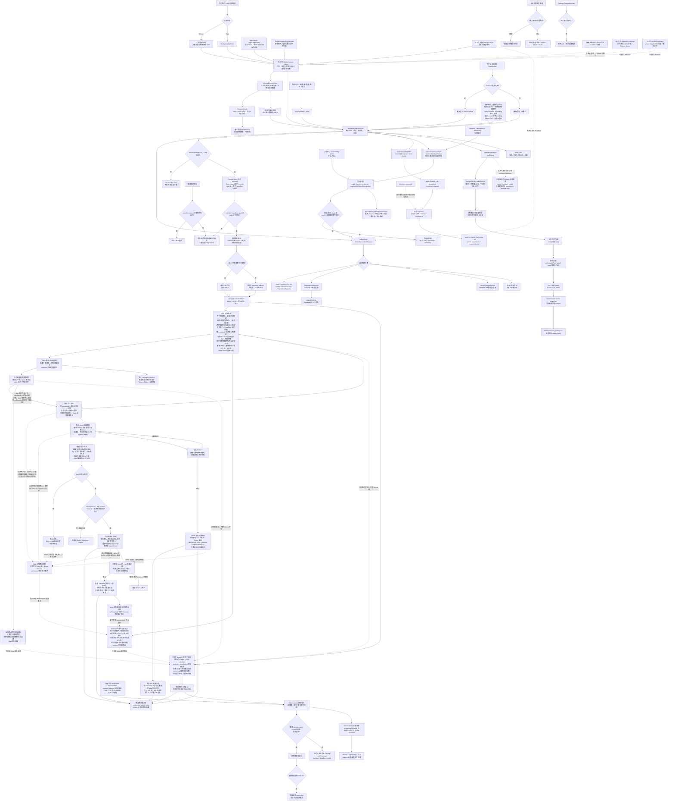
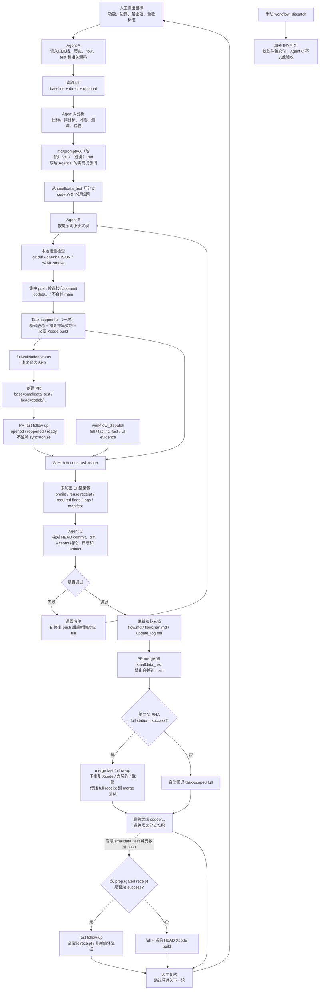
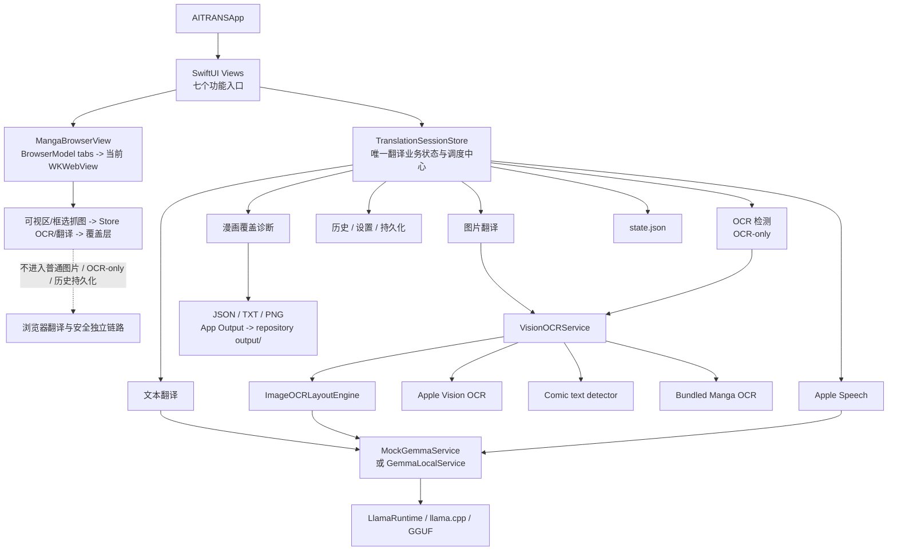
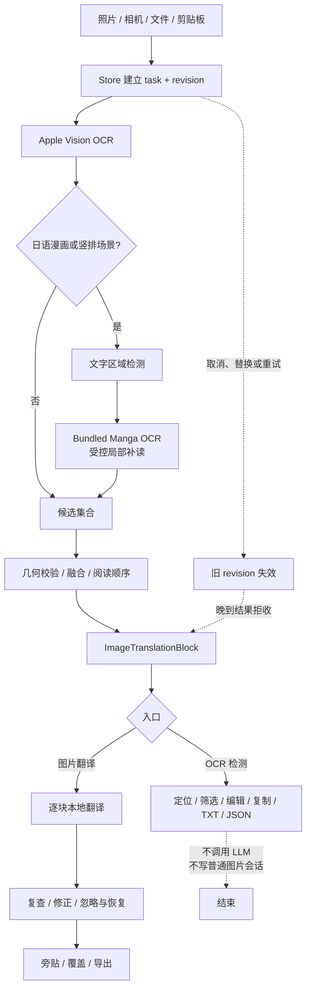
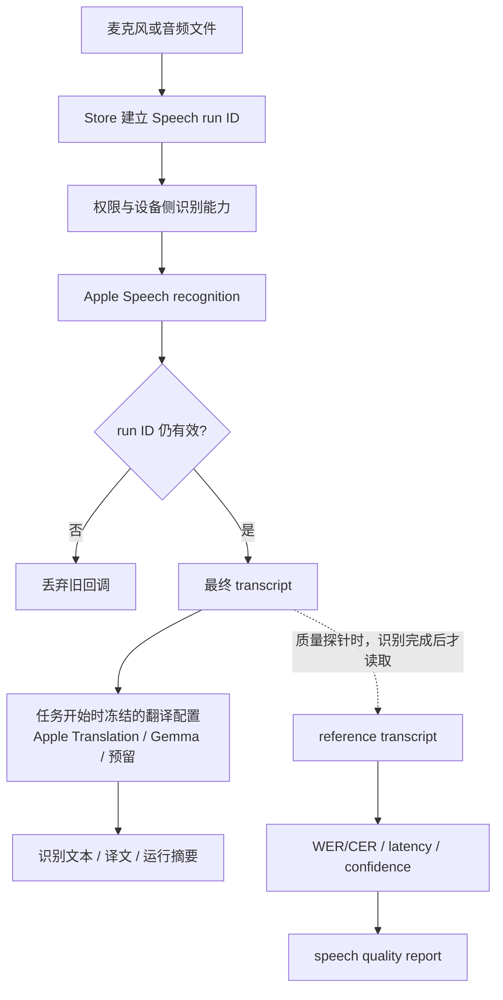
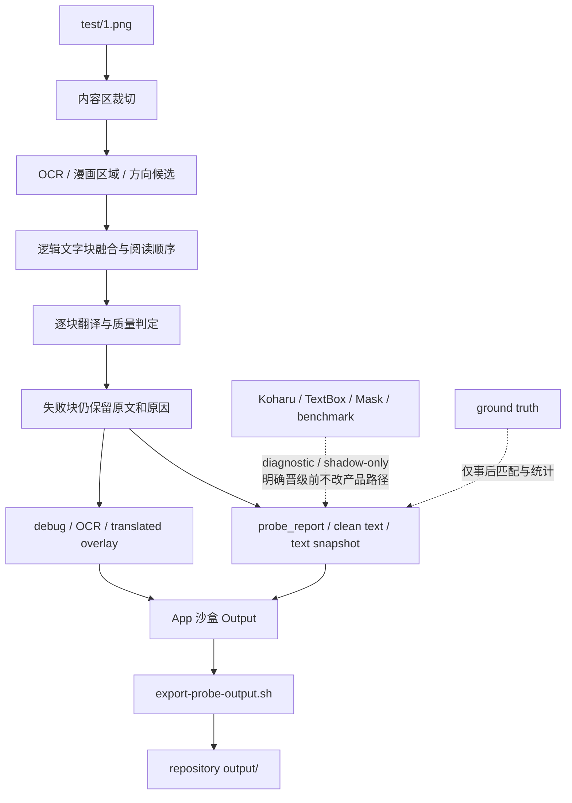
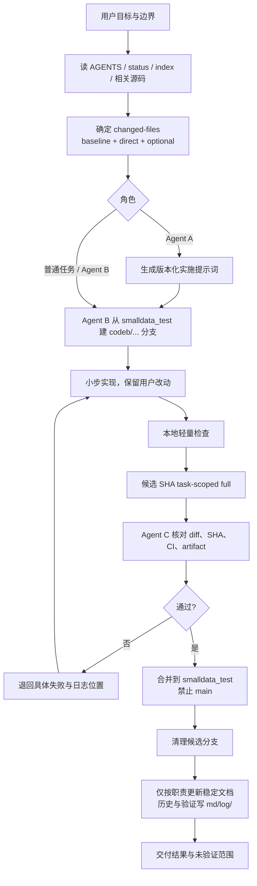

# 项目流程图

## 1. 项目核心逻辑图
这张图描述 App 从用户入口到状态调度、OCR/模型服务、持久化和探针输出的关系。

## 2. Agent 迭代流程图
这张图描述以后每轮任务如何从人工目标进入 Agent A、Agent B、GitHub Actions 和 Agent C。默认重验证在云端，本机只做轻量检查；`main` 不参与日常开发合并。

大版本合入后还必须执行一次首次使用体验闸门；具体日志字段、100 ms 底线、截图/产物清理和状态转移见 [`experience-iteration.md`](experience-iteration.md)。

范围选择先读取 `git diff --name-only <base>...HEAD`：所有任务保留 diff/路由基线；App 代码、工程或资源再保留基础 iOS simulator build；其余只跑本次命中的直接合同。`test/2.png`、截图、探针、GGUF、授权语料和目标设备属于显式可选证据。

# AITRANS 流程图

本文件只提供与 [`flow.md`](flow.md) 对齐的当前流程图，不记录版本演进、测试结果或 CI 日志。

## 1. App 架构

## 2. 图片与 OCR

## 3. 音频

## 4. 漫画覆盖诊断

## 5. Agent 迭代

流程图只在架构、ownership 或长期工作流变化时修改；单次版本、合同、CI 或指标变化只写入 `md/log/`。
